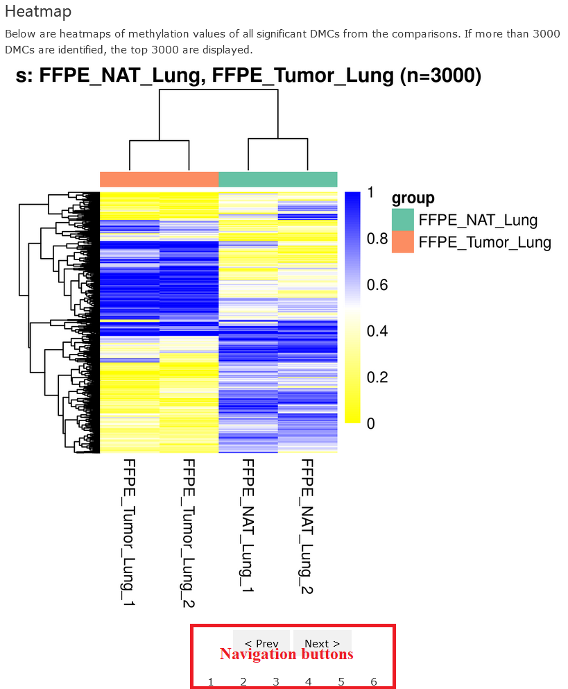

How to read the Methylseq report - advanced analysis
================
Zymo Bioinformatics
22 March, 2022

-   [Overview of the pipeline](#overview-of-the-pipeline)
-   [Report overview](#report-overview)
-   [Workflow of data processing](#workflow-of-data-processing)
-   [Sample information](#sample-information)
-   [Distribution of methylation
    values](#distribution-of-methylation-values)
    -   [Methylation distribution - per
        sample](#methylation-distribution---per-sample)
    -   [Methylation distribution - group
        means](#methylation-distribution---group-means)
-   [DMCs](#dmcs)
    -   [Summary](#summary)
    -   [Heatmap](#heatmap)
-   [DMRs](#dmrs)
    -   [Summary](#summary-1)
    -   [Heatmap](#heatmap-1)
    -   [Functional enrichment](#functional-enrichment)
-   [Downloads](#downloads)
    -   [DMC files](#dmc-files)
    -   [DMR files](#dmr-files)
    -   [Functional enrichment of DMR overlapping genes
        files](#functional-enrichment-of-dmr-overlapping-genes-files)

## Overview of the pipeline

The report was generated with Zymo **Methylseq Advanced Analysis**
pipeline built on the [nextflow](https://www.nextflow.io/) platform. A
example report can be found at
[here](../reports/MethylSeq_sample_report.advanced.html).

The analysis includes the following steps:

1.  Detect DMCs (differential methylated cytosines); available
    statistical methods include [Student’s
    t-test](https://en.wikipedia.org/wiki/Student%27s_t-test),
    [ANOVA](https://en.wikipedia.org/wiki/Analysis_of_variance),
    [Fisher’s exact
    test](https://en.wikipedia.org/wiki/Fisher%27s_exact_test), and
    [DSS](https://bioconductor.org/packages/release/bioc/html/DSS.html).

2.  Detect DMRs (differential methylated regions); available statistical
    methods include
    [DSS](https://bioconductor.org/packages/release/bioc/html/DSS.html)
    and
    [dmrseq](https://bioconductor.org/packages/release/bioc/html/dmrseq.html).

3.  Annotate both DMCs and DMRs by finding overlapped genes, promoters,
    exons, introns, and CpG islands.

4.  Functional enrichment analysis of DMR-overlapped genes by using the
    tool [g:Profiler](https://biit.cs.ut.ee/gprofiler/gost).

5.  Generate an html report with tables, figures, and downloading links.

## Report overview

This report is generated by
[diffMeth](https://github.com/Zymo-Research/diffMeth). It has a
navigation box on the left and the main results on the right. And the
results are divided into sections, including workflow summary, sample
information, DMCs and DMRs, functional enrichment analysis, and file
downloads.

<kbd style='border: 3px solid #9ecff7;'></kbd>

## Workflow of data processing

This section provides a summary of the data analysis, including the
thresholds used for filtering input data, the tools and parameters for
analyses, and the results generated.

<kbd style='border: 3px solid #9ecff7;'></kbd>

## Sample information

This section provides the sample information, including sample IDs and
their associated groups.

<kbd style='border: 3px solid #9ecff7;'></kbd>

## Distribution of methylation values

This section shows the distributions of methylation values for all CpGs
using the filtered data. The distributions are made at the both sample
and group levels.

The same color scheme is used in both per-sample and group-mean
distributions.

### Methylation distribution - per sample

The methylation values of all CpGs (after read depth filtering) in each
sample is presented in a [violin
plot](https://en.wikipedia.org/wiki/Violin_plot). The samples are
colored to distinguish different groups.

<kbd style='border: 3px solid #9ecff7;'></kbd>

### Methylation distribution - group means

The methylation values of each CpG are averaged over samples in a group
to derive group means, which are displayed in a [density
plot](https://en.wikipedia.org/wiki/Density_estimation). Note that only
CpGs that pass the filterings in all the groups are used, and when there
are more than 5 million CpGs, the sites are down-sampled to 5 million
for computing efficiency.

<kbd style='border: 3px solid #9ecff7;'></kbd>

## DMCs

DMCs, short for differential methylated cytosines, can be detected by
using various kinds of statistical methods. In this section, we present
a summary of the detected DMCs and the heatmaps of top significant DMCs
(reduced to 3000 if more are detected) for each group comparison.

### Summary

For each comparison, the table presents the compared groups, the number
of input sites (after filtering), the number of significant DMCs (both
hyper- and hypo-methylated) and the result’s filename. The filenames can
be used to download the data from the [Downloads](#downloads) section.

<kbd style='border: 3px solid #9ecff7;'></kbd>

### Heatmap

This section shows the heatmaps of methylation values for the DMCs
detected in each comparison. The heatmaps are organized in a slideshow
and one can click the buttons at the bottom to access different ones.

In each heatmap, the title at the top shows the groups under comparison
and the number of DMCs used (if more than 3000 DMCs detected, then only
top 3000 will be used). The dengrograms at the top and left show the
clustering of samples and sites, respectively. The clusterings were
computed using hierarchical clusterings with Eucleadian distances.

<kbd style='border: 3px solid #9ecff7;'></kbd>

## DMRs

DMRs stand for differential methylated regions. They can also be
detected by using various kinds of statistical methods. This section has
a similar structure as that of [DMCs](#dmcs), so one can find a summary
table as well as heatmaps for top DMRs.

### Summary

For each comparison, the table presents the compared groups, the number
of input sites (after filtering), the number of significant DMRs (both
hyper- and hypo-methylated) and the result’s filename. The filenames can
be used to download the data from the [Downloads](#downloads) section.

Note that many DMR statistical methods, such as DSS, don’t compute P
values, and thus no adjusted *P* values are computed.

<kbd style='border: 3px solid #9ecff7;'></kbd>

### Heatmap

This section shows the heatmaps of methylation values for the DMRs
detected in each comparison. Again, only top 3000 DMRs are presented.
The methylation value of each DMR in each sample is computed as follows:

where

and

provide the numbers of total and methylated reads at each site,
respectively.

Similarly, the dengrograms were computed using hierarchical clusterings
with Eucleadian distances.

<kbd style='border: 3px solid #9ecff7;'></kbd>

### Functional enrichment

This section shows the results of functional enrichment analysis of
DMR-overlapped genes using the platform
[g:Profiler](https://biit.cs.ut.ee/gprofiler/gost). Briefly, the
platform maps the provided gene list to functional terms and finds the
enriched terms. The functional terms come from various databases
(GeneOntology, KEGG, CORUM, etc). In the plot, each dot represents one
functional term with the statistical significance shown on the y-axis
(in the format
")).

<kbd style='border: 3px solid #9ecff7;'></kbd>

## Downloads

This section provides links to all kinds of downloadable results. At
present, the provided are DMCs, DMRs, and functional enrichment analysis
of DMR-overlapped genes.

<kbd style='border: 3px solid #9ecff7;'></kbd>

These files are normally tab- or comma- delimited, and compressed in
gzip. More details on the file formats are provided below:

### DMC files

The filename is named in the format of
*dms\_&lt;method&gt;.&lt;group1&gt;\_vs\_&lt;group2&gt;.tsv.gz*, where
*&lt;method&gt;* provides the statistical method (e.g., DSS), and
*&lt;group1&gt;* and *&lt;group2&gt;* are the compared group names.

Note that some columns are method-specific and thus omitted in output;
for example, the column ‘postprob.overThreshold’ is only available in
the output of DSS. The same principle applies to the DMR files.

<table>
<thead>
<tr>
<th style="text-align:left;">
Column
</th>
<th style="text-align:left;">
Description
</th>
</tr>
</thead>
<tbody>
<tr>
<td style="text-align:left;">
chr
</td>
<td style="text-align:left;">
Chromosome name of the DMC
</td>
</tr>
<tr>
<td style="text-align:left;">
pos
</td>
<td style="text-align:left;">
Chromosomal position of the DMC. 1-based. For a CpG, this position
always refers to the C on the plus strand.
</td>
</tr>
<tr>
<td style="text-align:left;">
group1Mean
</td>
<td style="text-align:left;">
The mean of methylation values for group 1 samples. For DSS-based
output, these values are smoothed.
</td>
</tr>
<tr>
<td style="text-align:left;">
group2Mean
</td>
<td style="text-align:left;">
The same as `group1Mean`, but for group 2.
</td>
</tr>
<tr>
<td style="text-align:left;">
methDiff
</td>
<td style="text-align:left;">
The difference between `group1Mean` and `group2Mean`.
</td>
</tr>
<tr>
<td style="text-align:left;">
diff.se
</td>
<td style="text-align:left;">
The standard error of `methDiff`
</td>
</tr>
<tr>
<td style="text-align:left;">
stat
</td>
<td style="text-align:left;">
The statistics computed for `methDiff`.
</td>
</tr>
<tr>
<td style="text-align:left;">
phi1
</td>
<td style="text-align:left;">
The estimated dispersions for group 1. Available for DSS method only.
</td>
</tr>
<tr>
<td style="text-align:left;">
phi2
</td>
<td style="text-align:left;">
The estimated dispersions for group 2. Available for DSS method only.
</td>
</tr>
<tr>
<td style="text-align:left;">
pValue
</td>
<td style="text-align:left;">
Raw P values
</td>
</tr>
<tr>
<td style="text-align:left;">
padj
</td>
<td style="text-align:left;">
Adjusted P values using the Benjamini & Hochberg method.
</td>
</tr>
<tr>
<td style="text-align:left;">
postprob.overThreshold
</td>
<td style="text-align:left;">
The posterior probability that `methDiff` is greater than prespecified
delta (default 0.1).
</td>
</tr>
<tr>
<td style="text-align:left;">
&lt;sampleId&gt;
</td>
<td style="text-align:left;">
The columns headed by sample Ids show the raw methylation value of each
DMC in each sample.
</td>
</tr>
</tbody>
</table>

### DMR files

The filename is named in the format of
*dmr\_&lt;method&gt;.&lt;group1&gt;\_vs\_&lt;group2&gt;.tsv.gz*, where
*&lt;method&gt;* provides the statistical method (e.g., DSS), and
*&lt;group1&gt;* and *&lt;group2&gt;* are the compared group names.

The file content is explained as follows:

<table>
<thead>
<tr>
<th style="text-align:left;">
Column
</th>
<th style="text-align:left;">
Description
</th>
</tr>
</thead>
<tbody>
<tr>
<td style="text-align:left;">
chr
</td>
<td style="text-align:left;">
Chromosome name of the DMR
</td>
</tr>
<tr>
<td style="text-align:left;">
start
</td>
<td style="text-align:left;">
Genomic start of the DMR, 1-based
</td>
</tr>
<tr>
<td style="text-align:left;">
end
</td>
<td style="text-align:left;">
Genomic end of the DMR, 1-based and inclusive
</td>
</tr>
<tr>
<td style="text-align:left;">
length
</td>
<td style="text-align:left;">
The length of the DMR in basepairs, i.e., from start to end
</td>
</tr>
<tr>
<td style="text-align:left;">
nCG
</td>
<td style="text-align:left;">
The number of CpGs included in the DMR
</td>
</tr>
<tr>
<td style="text-align:left;">
group1Mean
</td>
<td style="text-align:left;">
The DMR’s mean methylation level over group 1 samples; for DSS output,
it may be smoothed.
</td>
</tr>
<tr>
<td style="text-align:left;">
group2Mean
</td>
<td style="text-align:left;">
The same as `group1Mean`, but over group 2 samples.
</td>
</tr>
<tr>
<td style="text-align:left;">
methDiff
</td>
<td style="text-align:left;">
The methylation difference between the two groups.
</td>
</tr>
<tr>
<td style="text-align:left;">
areaStat
</td>
<td style="text-align:left;">
The sum of the test statistics of all CpG sites within the DMR
</td>
</tr>
<tr>
<td style="text-align:left;">
&lt;sampleId&gt;
</td>
<td style="text-align:left;">
The columns headed by sample Ids show the methylation value of the DMR
in each sample, i.e., the mean of all CpGs within the DMR.
</td>
</tr>
</tbody>
</table>

### Functional enrichment of DMR overlapping genes files

These files are generated by
[gprofiler](https://biit.cs.ut.ee/gprofiler/gost), implemented in R
package
[gprofiler2](https://cran.r-project.org/web/packages/gprofiler2/index.html).
The files show the significant functional terms. One can find more
information on the analysis and the output format by visiting
[here](https://biit.cs.ut.ee/gprofiler/page/docs) and
[here](https://cran.r-project.org/web/packages/gprofiler2/vignettes/gprofiler2.html).

The filename is named in the format of
*func\_enrich.dmr\_&lt;method&gt;.&lt;group1&gt;\_vs\_&lt;group2&gt;.enrich\_analysis.gprofiler.tsv*,
where *&lt;method&gt;* provides the statistical method (e.g., DSS), and
*&lt;group1&gt;* and *&lt;group2&gt;* are the compared group names.

| Column                  | Description                                                                                                                                   |
|:------------------------|:----------------------------------------------------------------------------------------------------------------------------------------------|
| query                   | A label for input query. The value is the same for one set of DMRs.                                                                           |
| significant             | *TRUE* if the functional enrichment is significant; otherwise *FALSE*.                                                                        |
| p\_value                | Hypergeometric p-value after correction for multiple testing.                                                                                 |
| term\_size              | The number of genes that are annotated to the functional term genomewide.                                                                     |
| query\_size             | The number of input genes, should be constant for an analysis.                                                                                |
| intersection\_size      | The number of input genes annotated to the term.                                                                                              |
| precision               | The proportion of genes in the input list that are annotated to the term, i.e., *intersection\_size/query\_size*.                             |
| recall                  | The proportion of genes in the term that the query recovers, i.e., *intersection\_size/term\_size*.                                           |
| term\_id                | Unique term identifier, e.g <GO:0005005>.                                                                                                     |
| source                  | Abbreviated source name for the term, e.g., <GO:BP>.                                                                                          |
| term\_name              | Short name of the functional term.                                                                                                            |
| effective\_domain\_size | The total number of genes annotated in the source domain. E.g., all the genes annotated in <GO:BP>.                                           |
| source\_order           | The numeric order for the term within its source domain.                                                                                      |
| parents                 | A list of term IDs that are hierarchically directly above the term. For non-hierarchical data sources this points to an artificial root node. |
