How to read the Methylseq report - basic analysis
================
Zymo Bioinformatics
07 September, 2021

-   [Overview of the pipeline](#overview-of-the-pipeline)
-   [Report overview](#report-overview)
-   [General Statistics](#general-statistics)
-   [Cutadapt](#cutadapt)
    -   [Trimmed Sequence Lengths](#trimmed-sequence-lengths)
    -   [Filtered Reads](#filtered-reads)
-   [FastQC (trimmed)](#fastqc-trimmed)
    -   [Sequence Quality Histograms](#sequence-quality-histograms)
    -   [Per Sequence Quality Scores](#per-sequence-quality-scores)
    -   [Per Base Sequence Content](#per-base-sequence-content)
    -   [Per Sequence GC Content](#per-sequence-gc-content)
    -   [Overrepresented sequences](#overrepresented-sequences)
    -   [Adapter Content](#adapter-content)
-   [Bismark](#bismark)
    -   [Alignment Rates](#alignment-rates)
    -   [Strand Alignment](#strand-alignment)
    -   [M-bias](#m-bias)
-   [Insert Size](#insert-size)
-   [CpG Coverage](#cpg-coverage)
-   [Genomic Region Coverage](#genomic-region-coverage)
    -   [Promoter](#promoter)
    -   [Gene Body](#gene-body)
    -   [CpG Island](#cpg-island)
-   [Bismark (spike-in)](#bismark-spike-in)
    -   [Strand Alignment](#strand-alignment-1)
-   [Samtools (spike-in)](#samtools-spike-in)
    -   [Mapped reads per contig](#mapped-reads-per-contig)
-   [MethylDackel (spikein)](#methyldackel-spikein)
    -   [Correlation Scatter Plot](#correlation-scatter-plot)
    -   [Correlation Table](#correlation-table)
-   [Download](#download)
-   [Summary and Software Versions](#summary-and-software-versions)

## Overview of the pipeline

The report was generated with our **Methylseq Basic Analysis** pipeline
built on [nextflow](https://www.nextflow.io/) platform. A example report
can be found at [here](../reports/MethylSeq_sample_report.basic.html).

The backbone of the pipeline is as follows:

1.  Input reads trimming by [Trim
    Galore](https://github.com/FelixKrueger/TrimGalore).

2.  Reads quality assessment by
    [FastQC](https://github.com/s-andrews/FastQC).

3.  Reads alignment by
    [bismark](https://github.com/FelixKrueger/Bismark).

4.  Methylation calling by
    [MethylDackel](https://github.com/dpryan79/MethylDackel).

5.  Library insert size distribution by
    [picard](https://gatk.broadinstitute.org/hc/en-us/articles/360037055772-CollectInsertSizeMetrics-Picard-).

6.  Read coverage per cytosine by
    [bedtools](https://bedtools.readthedocs.io/en/latest/).

7.  Library quality metrics using **Zymo *In situ* Spike-in Control**.

8.  Generating downloadable files.

## Report overview

This bioinformatics report is generated using
[MultiQC](https://multiqc.info/), which is integrated into the nextflow
pipeline. There are general instructions on how to read a MultiQC report
at [here](https://multiqc.info/docs/#using-multiqc-reports), or you can
watch [this video](https://www.youtube.com/watch?v=qPbIlO_KWN0). In
general, the report has a navigation bar to the left, allowing to
quickly navigate to any section in the report. Next to it on the right
are result sections, which are interactive: hovering mouse over or
clicking these tables/figures will lead to more details. On the right
edge, there is a toolbox that allows to customize the appearance of the
report and export figures and data.

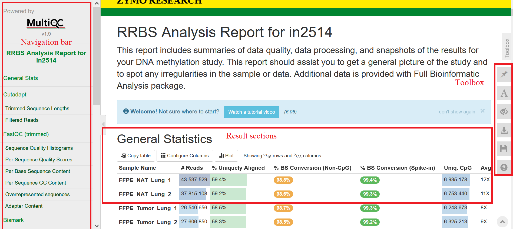

## General Statistics

The table *General Statistics* provides some import statistics of the
data. Here are some you can use to assess the data:

-   **% Uniquely Aligned** This is the percentage of total uniquely
    aligned read pairs (or reads in single-end sequencing) to the target
    genome. In general, the higher the percentage, the better. The value
    however varies among sample types and library protocols. The total
    number of reads is shown in column `# Reads`.

-   **% BS Conversion (Spike-in)** This is the bilsulfite (BS)
    conversion rate computed based on the reads derived from our **Zymo
    *In situ* Spike-in Control**. The Spike-ins consist of 6 DNA
    fragments with known CpG methylation levels, so their measured
    methylation levels can be used to compute on BS conversion rates.

-   **% BS Conversion (Non-CpG)** This metric provides another
    measurement on BS conversion rates, calculated as 1 minus the
    average methylation level in the CHG and CHH contexts, assuming no
    methylation at all in those two contexts. However, the assumption
    may not be valid in some circumstances such as in plant, so a BS
    conversion rate from Spike-ins is a better estimate.

-   **Uniq. CpG** This is the number of CpG cytosines in the genome
    covered by reads.

-   **Avg. CpG Coverage** This is the average number of reads covering
    each cytosine as reported in the `Uniq. CpG` column. Please also
    refer to the section [CpG Coverage](#cpg-coverage) for the counts of
    cytosines at different read coverage levels.

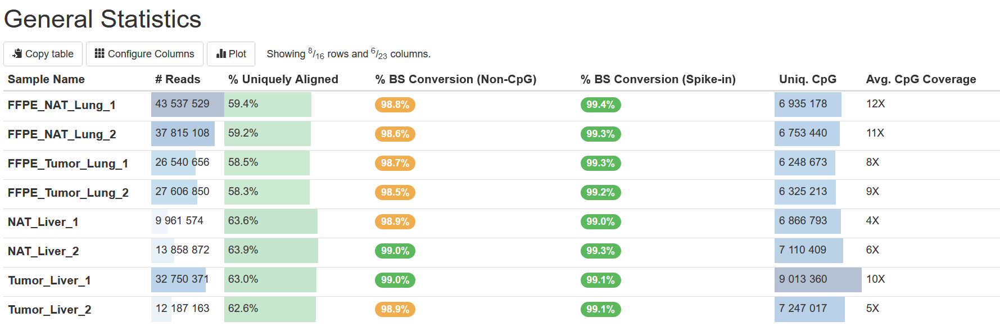

## Cutadapt

TrimGalore internally calls `cutadapt` to trim low-quality bases and
adapters from reads. This section presents the results of trimmed
fragments and the remained reads after trimming and filtering.

### Trimmed Sequence Lengths

In this plot, the x-axis shows the length of each trimmed fragment (the
part discarded), and the y-axis shows the number of reads for each case.
Normally, the number drops quickly as the lengths of trimmed segments
increase, because for most reads, only a few bases are derived from
adapters or of low quality. For RRBS, however you may see some peaks in
the middle because of short library insert sizes.

The tab `Obs/Exp` presents the ratio of observed and expected counts for
a given trimmed length. The expected count is computed by assuming
sequencing error only. A ratio higher than 1 indicates that some trimmed
segments are true adapters. One can see [cutadapt’s
guide](https://cutadapt.readthedocs.io/en/latest/guide.html#how-to-read-the-report)
for more explanation.

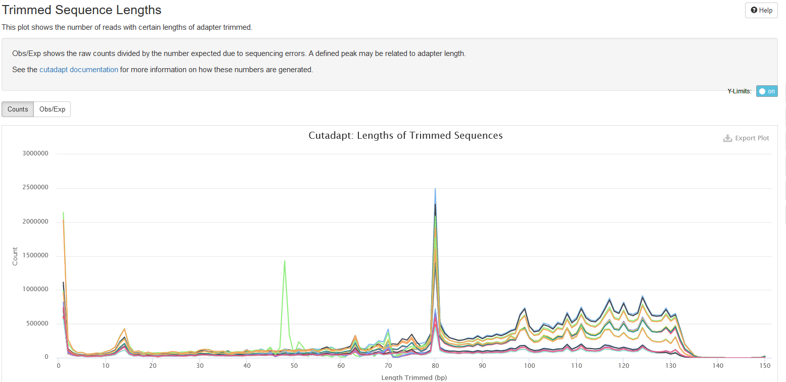

### Filtered Reads

In this plot, it shows the number of reads passing the filtering of
TrimGalore. TrimGalore trims low-quality bases and adapters from the
3’end of each read and filters out reads that are shorter than 20bps.
And in the paired-end mode, both reads in a pair are discarded if either
of them is shorter than 20 bps, and this is why the read1 and read2
files of one sample always have the same number of filtered reads.

For RRBS sequencing, the option `--rrbs` for TrimGalore is on to remove
filled-in bases at read ends introduced during library preparation. For
more details on how TrimGalore removes the filled-ins, please refer to
the [TrimGalore
Manual](https://github.com/FelixKrueger/TrimGalore/blob/master/Docs/Trim_Galore_User_Guide.md#step-2-adapter-trimming).

One can toggle the tabs between *Counts* and *Percentages* to view the
numbers and percentages of filtered reads, a feature available for most
plots in the report.

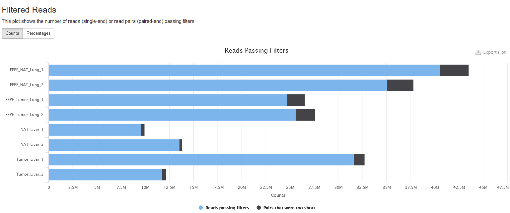

## FastQC (trimmed)

This section shows the *FastQC* analyses run on trimmed fastq files.
[FastQC](http://www.bioinformatics.babraham.ac.uk/projects/fastqc/Help/)
is a tool to analyze library qualities by examining the metrics such as
base qualities, GC content, overrepresented and adapter sequences. A
warning is issued if any metric fails.

### Sequence Quality Histograms

This section shows the average [Phred quality
scores](https://gatk.broadinstitute.org/hc/en-us/articles/360035531872-Phred-scaled-quality-scores)
per base along read length. Normally, the base quality decreases towards
3’end. This provides information on whether 3’end quality trimming is
needed.

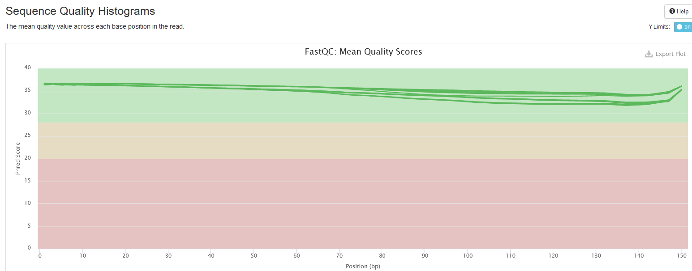

### Per Sequence Quality Scores

This plot shows the distributions of read sequence quality, computed by
averaging the Phred scores of all bases in a read. It is expected that
peaks are at values &gt; 28; if you see peaks at lower values, it is a
warning sign of low quality libraries.

### Per Base Sequence Content

This plot shows the percentages of the four nucleotides (A, T, C, G) at
each read position; each base is in different color. The heatmap shows
average base compositions with samples as rows and positions as columns.
When hovering mouse over the plot, the nucleotide compositions are shown
at top of the plot.

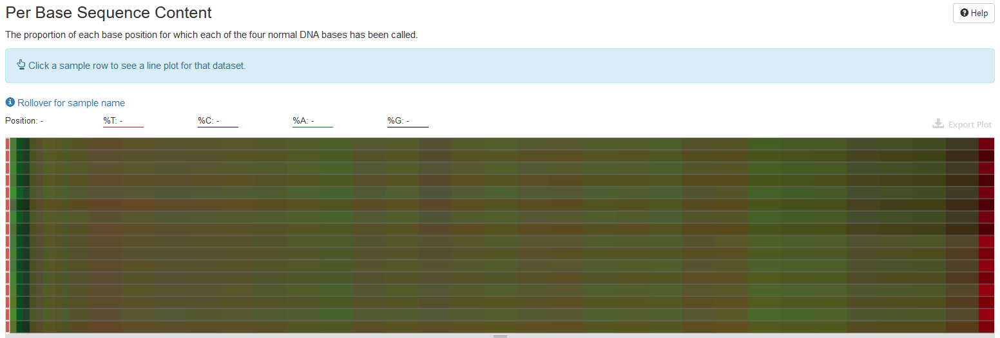

One can click on one row/sample to have a detailed view on how
nucleotide composition changes over read length. The composition is
expected to be even over read length.

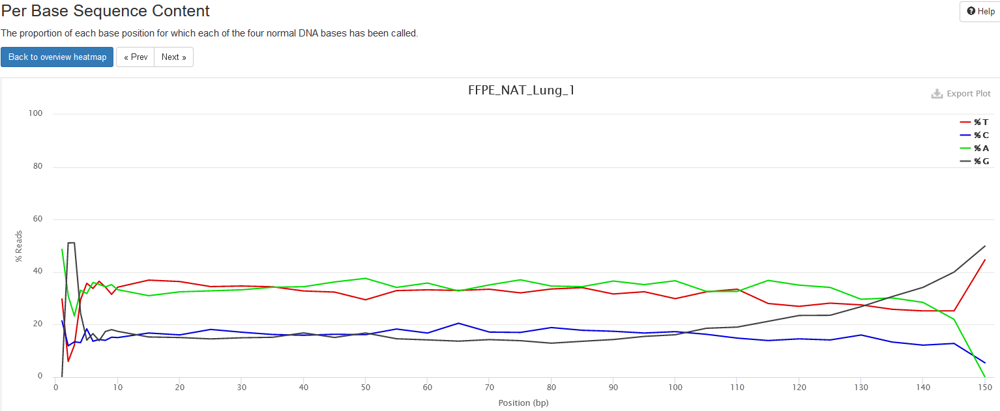

### Per Sequence GC Content

This plot shows the distributions of reads’ GC content, that is, the
percentages of G and C nucleotides in a read.

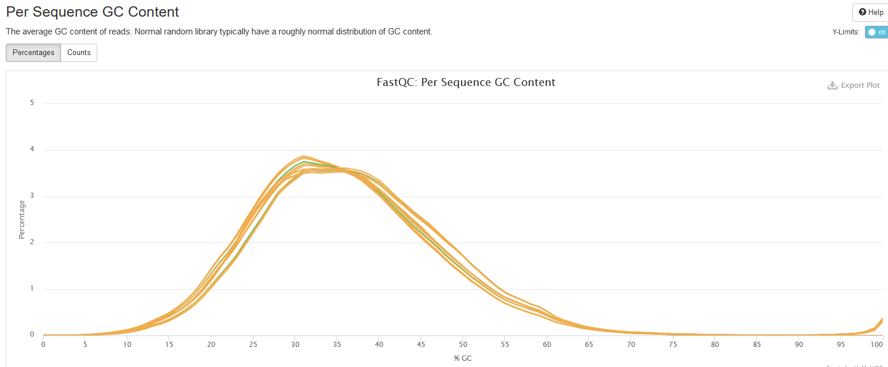

### Overrepresented sequences

If there are overrepresented sequences, such as contamination, enriched
fragments, or duplicated reads, this section will show the frequencies
of the top representative sequences (frequency &gt; 0.1%).

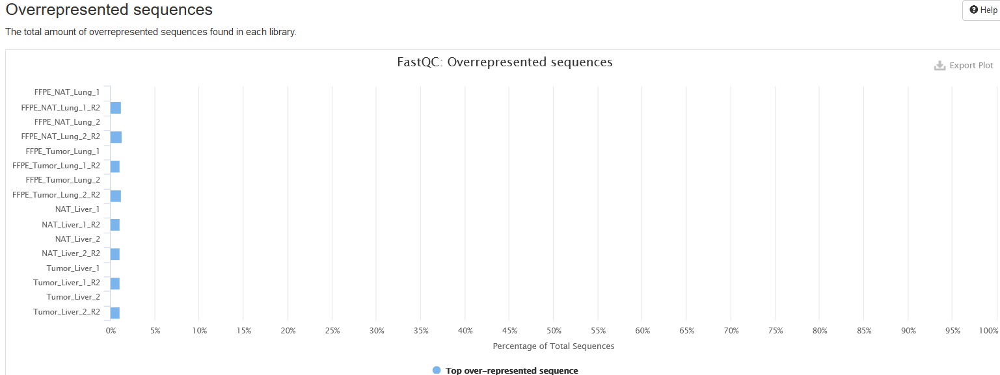

### Adapter Content

This plot shows the percentage of reads containing an adapter sequence
at each base position cumulatively, so if a read contains an adapter at
a position, then this read is counted for all subsequent positions.

When running this analysis on already trimmed sequences, one expects to
see no adapters, as displayed here.

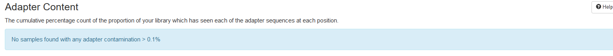

## Bismark

[Bismark](https://www.bioinformatics.babraham.ac.uk/projects/bismark/)
is a tool to align bisulfite-converted sequencing reads to a genome. One
can find the manual of the program at
[here](https://github.com/FelixKrueger/Bismark).

### Alignment Rates

This plot shows the number and percentage of reads in each of the
following categories:

-   Aligned Uniquely: reads that are mapped to a unique genomic
    position.

-   Aligned Ambiguously: reads that are mappable to multiple genomic
    positions.

-   Did Not Align: reads that are not alignable to the genome.

For downstream analyses such as calling methylation, only *Aligned
Uniquely* reads are used.

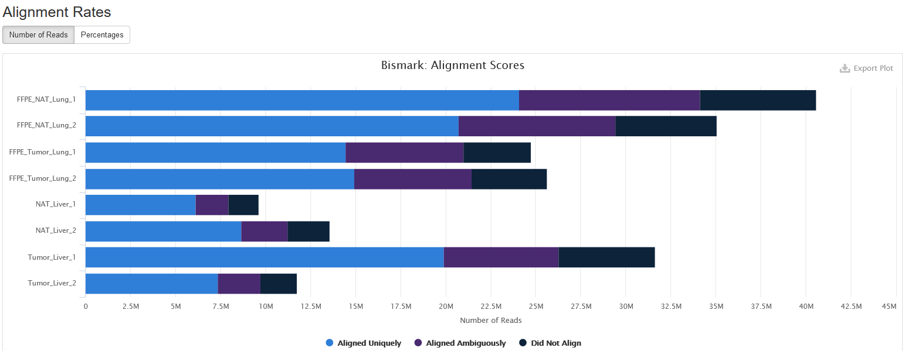

### Strand Alignment

This plot shows which strand each read pair is aligned to. Due to
bisulfite conversion, there are four strands that a read pair can align:

1.  Original top strand: the top/Waston strand.

2.  Complementary to original top strand: the strands complementary to
    the top/Waston strands, generated through PCR.

3.  Original bottom strand: the bottom/Crick strand.

4.  Complementary to original bottom strand: the strand complementary to
    the bottom/Crick strand, generated through PCR.

For a directional sequencing library, you may only see reads from
original top and bottom strands, but for non-directional one, you will
see reads from all four strands.

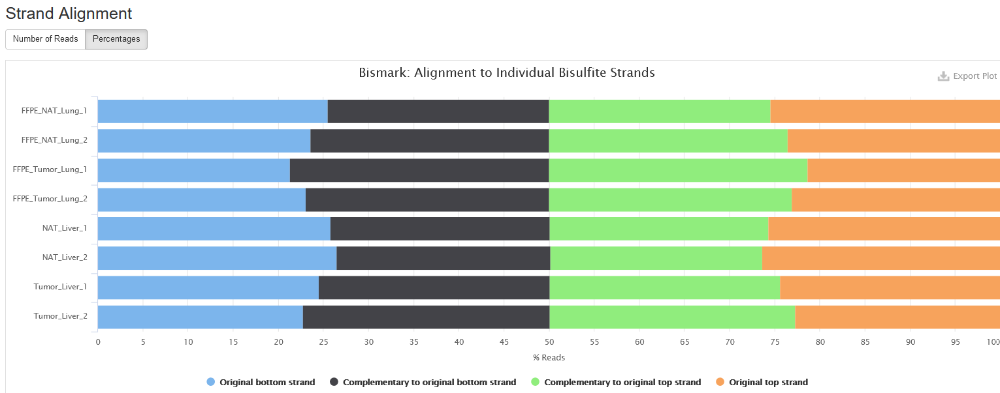

### M-bias

This plot presents the methylation values along base positions in a
read. The methylation value is computed by averaging the methylation
values at a position across all reads in a sample. Normally, one expects
the methylation value stays constant along base positions.

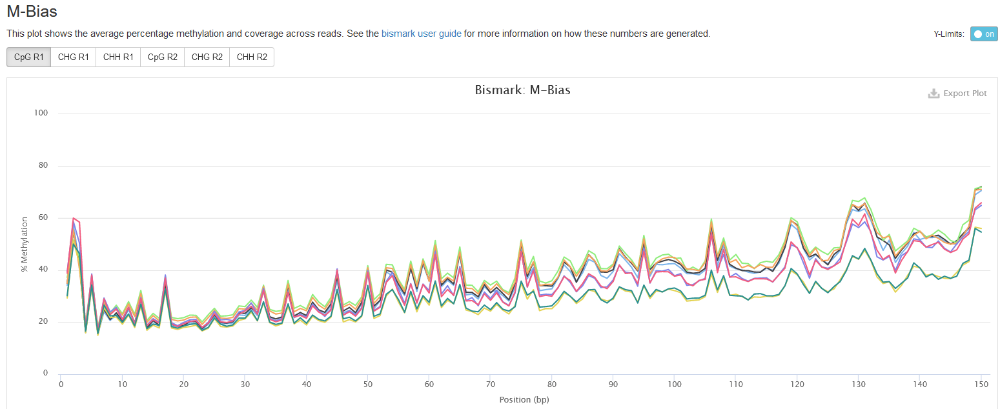

## Insert Size

This shows the distribution of estimated insert sizes for each sample.
For RRBS, one may see multiple spikes in the range from 40 to 220 bps
due to *MspI* digestions (see explanation
[here](http://www.bioinformatics.babraham.ac.uk/projects/bismark/RRBS_Guide.pdf)).

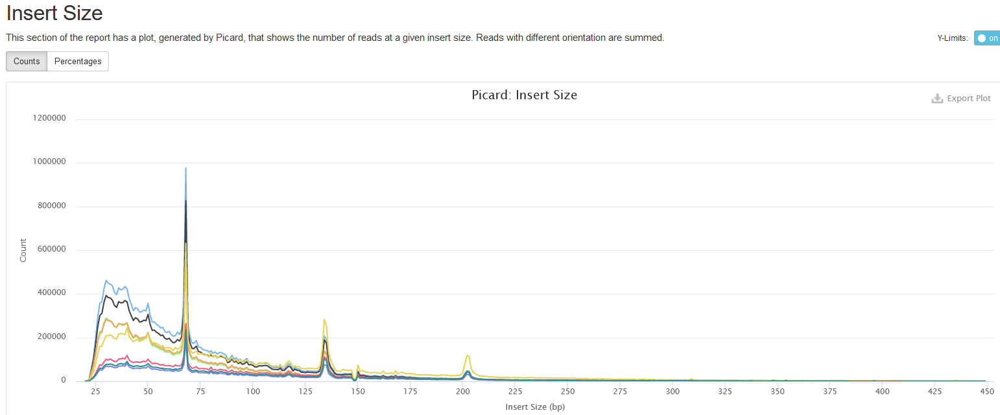

## CpG Coverage

This plot presents the number and percentage of cytosines in CpG context
under different read coverages. Here, only cytosines covered by at least
one read are considered. For easy visualization, the read coverage (aka.
read depth) is divided into four ranges: 1-4, 5-9, 10-49, &gt;=50.

## Genomic Region Coverage

This section presents the number of reads mapped to each functional
region. At present, we consider the following functional regions: gene
body, CpG island, and promoter. Following the procedure in [this
paper](https://www.nature.com/articles/nmeth.1414), the coverage in a
region is calculated as the number of measurements on CpGs in the
region.

### Promoter

Promoter is defined as the 2000-bp region upstream of a gene start.

As you can see, the coverages are divided into ranges based on their
coverage levels. You can also toggle between `Counts` and `Percentages`
tabs.

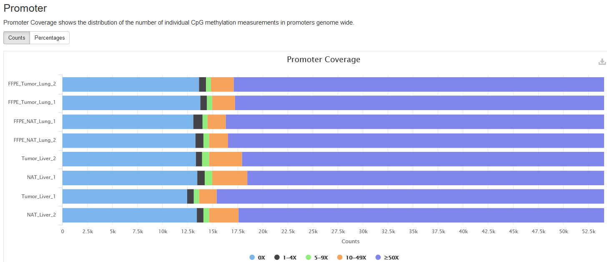

### Gene Body

Gene body is the genomic region from a gene’s first base to last, so
both exons and introns are included.

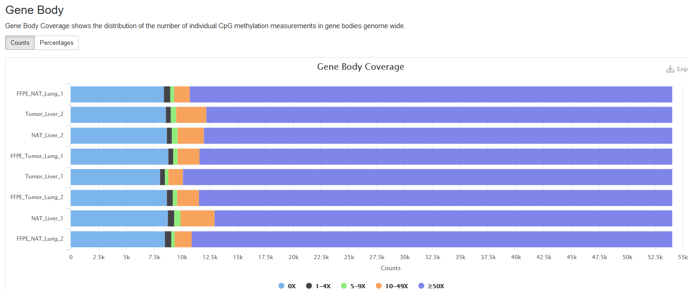

### CpG Island

CpG islands are clusters of CpGs and often defined operationally. Here,
we use the definition by [Gardiner-Garden M and Frommer
M.](https://www.ncbi.nlm.nih.gov/pubmed/3656447), and use the max
scoring algorithm to identify them. More on the CpG island criteria can
be found at
[UCSC](https://genome.ucsc.edu/cgi-bin/hgTrackUi?hgsid=998595637_fiKBxHtrl6naFyjEJbvl4P9Nhuc0&c=chr12&g=cpgIslandExt).

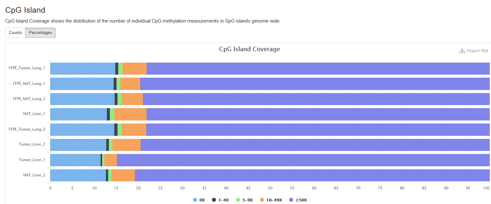

## Bismark (spike-in)

### Strand Alignment

This section shows the numbers of reads aligned to spike-in sequences in
each sample. Similar to the plot for mapped-to-genome reads, the
alignments to each strand are separated.

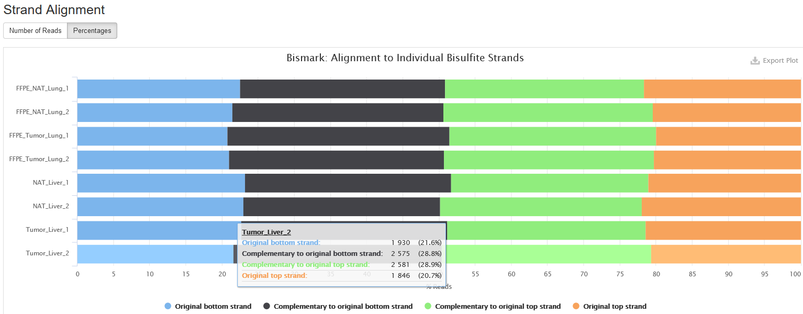

## Samtools (spike-in)

### Mapped reads per contig

Similar to the preceding section, but the alignments are categorized
based on the spikein sequences, namely amplicons. There are totally 6
amplicons.

## MethylDackel (spikein)

In this section, we show the correlation between observed and expected
methylation values for the spikein sequences. The observed methylation
values are extracted from bam files using
[MethylDackel](https://github.com/dpryan79/MethylDackel), and compared
to the known/expected methylation values for each spikein sequence. A
significant deviation of observed methylation values from expected ones
can be a sign of incomplete bisulfite conversion, among other issues.

### Correlation Scatter Plot

This subsection presents a correlation plot of expected (x axis) and
observed (y axis) methylation values for all spikein sequences. The
points are expected to fall around a slope line of 45 degrees.

### Correlation Table

This table presents the *Pearson* correlation coefficients between the
expected and observed methylation values for spikein sequences, which
are more quantitative measurements than the aforementioned correlation
plots.

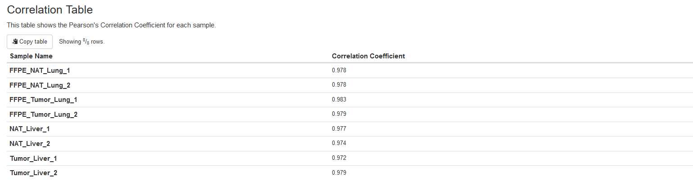

## Download

This section provides links to all kinds of downloadable data that the
pipeline generated.

Note that the links are valid for a limited time (default 90 days).

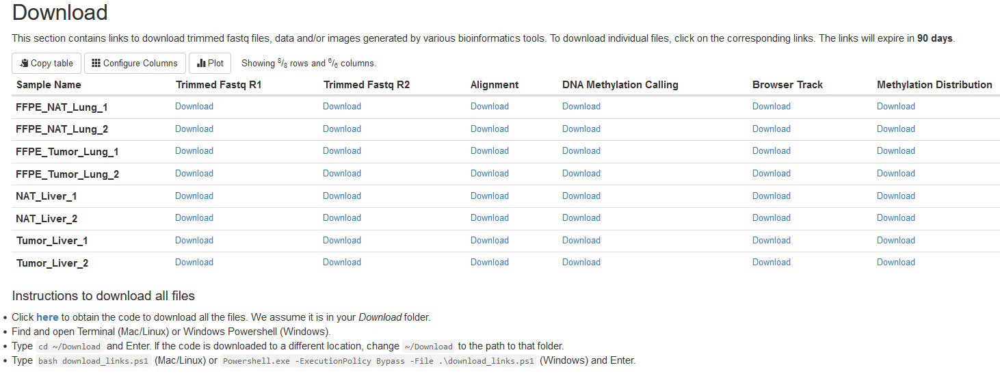

The data content of each file type is explained below:

-   *Trimmed Fastq R1*: Read 1 fastq files after trimming by TrimGalore.

-   *Trimmed Fastq R2*: Read 2 fastq files after trimming by TrimGalore.

-   *Alignment*: Bam files generated by bismark.

-   *DNA methylation calling*: Bedgraph files containing the numbers of
    reads supporting methylation and nonmethylation for each cytosine in
    the genome. These files are generated with
    [MethylDackel](https://github.com/dpryan79/MethylDackel).

    Each file has 6 columns (separated by tab) as follows:

    1.  The chromosome name.
    2.  The start coordinate of a cytosine on the chromosome.
    3.  The end coordinate of a cytosine on the chromosome.
    4.  The methylation percentage rounded to an integer.
    5.  The number of reads/pairs reporting methylation status.
    6.  The number of reads/pairs reporting nonmethylation status.

    One can find more information on the format by checking the
    [MethylDackel page](https://github.com/dpryan79/MethylDackel).

-   *Browser Track*: The UCSC browser tracks in [bigbed
    format](https://genome.ucsc.edu/goldenPath/help/bigBed.html). One
    can view these files directly in the UCSC browser. An instruction on
    how to view bigbed files in UCSC custom tracks can be found
    [here](https://genome.ucsc.edu/goldenPath/help/bigBed.html).

-   *Methylation Distribution*: Figures displaying methylation value
    distributions in functional regions, including CpG islands, gene
    bodies, and promoters.

## Summary and Software Versions

This section shows some parameters used in data analyses, such as
library type, genome assembly, etc.

The software versions used in the pipeline are also listed.

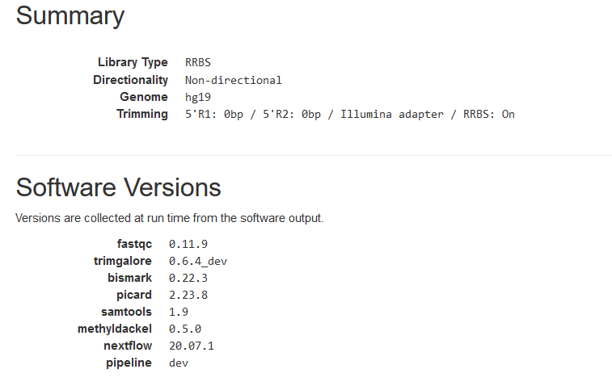
