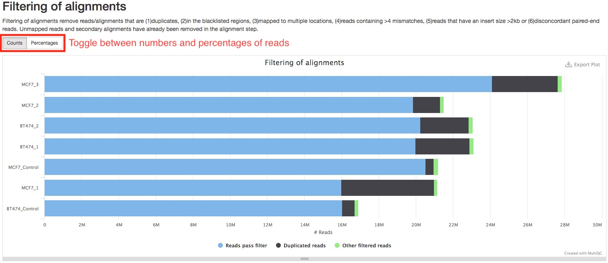
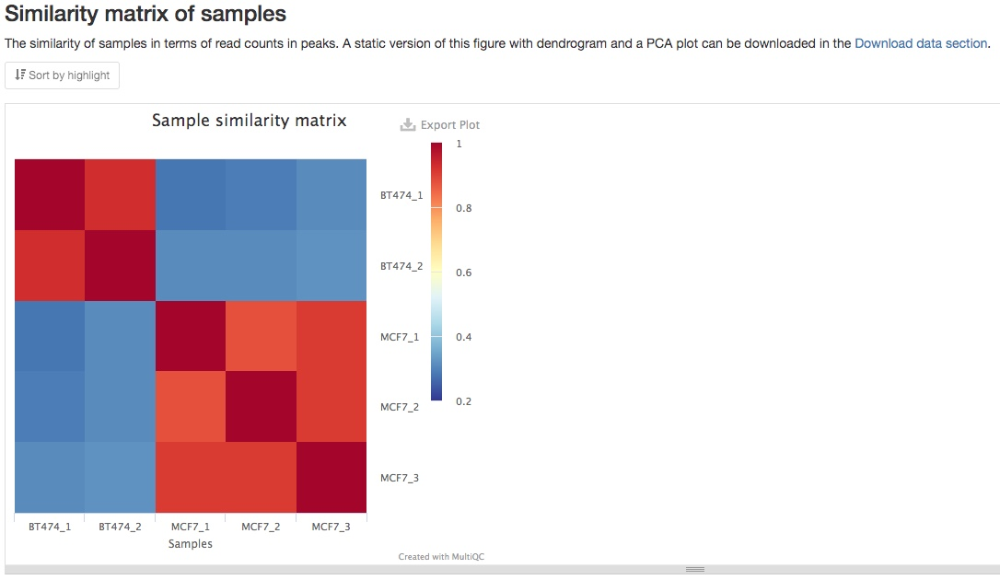
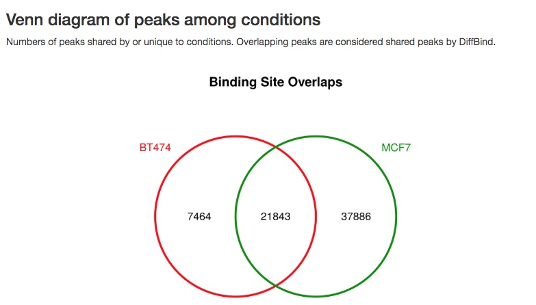
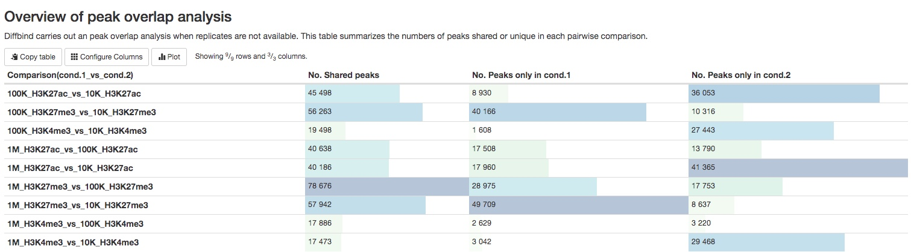

# How to interpret the ChIPseq report

This document describes how to understand the ChIPseq bioinformatics report delivered to you by Zymo. Most of the plots are taken from the [sample report](https://zymo-research.github.io/service-pipeline-documentation/reports/ChIPseq_sample_report.html). The plots in your report might look a little different.

## Table of contents
* [Table of contents](#table-of-contents)
* [Bioinformatics pipeline overview](#bioinformatics-pipeline-overview)
* [Report overview](#report-overview)
* [General statistics table](#general-statistics-table)
* [Analysis of sequencing runs](#analysis-of-sequencing-runs)
  * [FastQC](#fastqc)
  * [Cutadapt](#cutadapt)
  * [Alignment stats](#alignment-stats)
* [Analysis of samples](#analysis-of-samples)
  * [Preseq](#preseq)
  * [Filtering of alignments](#filtering-of-alignments)
  * [deepTools](#deeptools)
  * [Strand-shift correlation plot](#strand-shift-correlation-plot)
  * [NSC and RSC coefficients](#nsc-and-rsc-coefficients)
* [Comparison of IP and control samples](#comparison-of-IP-and-control-samples)
  * [MACS2](#macs2)
  * [HOMER](#homer)
* [Differential binding](#differential-binding)
* [Download data](#download-data)
* [Pipeline information](#pipeline-information)
  * [Software versions](#software-versions)
  * [Workflow summary](#workflow-summary)

## Bioinformatics pipeline overview

The ChIPseq bioinformatics pipeline is built using [Nextflow](https://www.nextflow.io/) and adapted from [nf-core/chipseq pipeline v1.1.0](https://github.com/nf-core/chipseq). A brief summary of pipeline:

1. Raw read QC ([`FastQC`](https://www.bioinformatics.babraham.ac.uk/projects/fastqc/))
2. Adapter trimming ([`Trim Galore!`](https://www.bioinformatics.babraham.ac.uk/projects/trim_galore/))
3. Alignment ([`BWA`](https://sourceforge.net/projects/bio-bwa/files/))
4. Merge alignments from multiple libraries of the same sample, if applicable ([`picard`](https://broadinstitute.github.io/picard/))
5. For each sample: 
    1. Mark duplicates ([`picard`](https://broadinstitute.github.io/picard/))
    2. Filtering to remove:
        * reads mapping to blacklisted regions ([`SAMtools`](https://sourceforge.net/projects/samtools/files/samtools/), [`BEDTools`](https://github.com/arq5x/bedtools2/))
        * reads that are marked as duplicates ([`SAMtools`](https://sourceforge.net/projects/samtools/files/samtools/))
        * reads that arent marked as primary alignments ([`SAMtools`](https://sourceforge.net/projects/samtools/files/samtools/))
        * reads that are unmapped ([`SAMtools`](https://sourceforge.net/projects/samtools/files/samtools/))
        * reads that map to multiple locations ([`SAMtools`](https://sourceforge.net/projects/samtools/files/samtools/))
        * reads containing > 4 mismatches ([`BAMTools`](https://github.com/pezmaster31/bamtools))
        * reads that have an insert size > 2kb ([`BAMTools`](https://github.com/pezmaster31/bamtools); *paired-end only*)
        * reads that map to different chromosomes ([`Pysam`](http://pysam.readthedocs.io/en/latest/installation.html); *paired-end only*)
        * reads that arent in FR orientation ([`Pysam`](http://pysam.readthedocs.io/en/latest/installation.html); *paired-end only*)
        * reads where only one read of the pair fails the above criteria ([`Pysam`](http://pysam.readthedocs.io/en/latest/installation.html); *paired-end only*)
    3. Alignment-level QC and estimation of library complexity ([`Preseq`](http://smithlabresearch.org/software/preseq/))
    4. Create normalised bigWig files scaled to 1 million mapped reads ([`BEDTools`](https://github.com/arq5x/bedtools2/), [`bedGraphToBigWig`](http://hgdownload.soe.ucsc.edu/admin/exe/))
    5. Generate gene-body meta-profile from bigWig files ([`deepTools`](https://deeptools.readthedocs.io/en/develop/content/tools/plotProfile.html))
    6. Calculate strand cross-correlation peak and ChIP-seq quality measures including NSC and RSC ([`phantompeakqualtools`](https://github.com/kundajelab/phantompeakqualtools))
6. For each IP-control pair:
    1. Calculate genome-wide IP enrichment relative to control ([`deepTools`](https://deeptools.readthedocs.io/en/develop/content/tools/plotFingerprint.html))
    2. Generate fold-enrichment bigWig files by comparing IP and control BAM files ([`deepTools`](https://deeptools.readthedocs.io/en/develop/content/tools/bamCompare.html)) 
    3. Call broad/narrow peaks ([`MACS2`](https://github.com/taoliu/MACS))
    4. Annotate peaks relative to gene features ([`HOMER`](http://homer.ucsd.edu/homer/download.html))
7. Compare different IP samples. Generate a consensus peak set. Conduct statistical analysis of differential binding if replicates are available; conduct simple peak overlap analysis if replicates are not available. ([`DiffBind`](https://bioconductor.org/packages/release/bioc/html/DiffBind.html)). Annotate differential binding results or peak overlap results again ([`HOMER`](http://homer.ucsd.edu/homer/download.html))
8. Present all QC, analysis results in an interactive, comprehensive report ([`MultiQC`](http://multiqc.info/))

## Report overview
The bioinformatics report is generated using [`MultiQC`](https://multiqc.info/). There are general instructions on how to use a MultiQC report how [MultiQC website](https://multiqc.info/). The report itself also includes a link to a instructional video at the top of the report. In general, the report has a navigation bar to the left, which allows you to quickly navigate to one of many sections in the report. On the right side, there is a toolbox that allows to customize the appearance of your report and export figures and/or data. Most sections of the report are interactive. The plots will show you the sample name and values when you mouse over them.

## General statistics table
The general statistics table gives an overview of some important stats of your sequencing runs and/or samples. For example, how many reads were in each run, what are the alignment rate, and how many peaks were called in each sample. These stats are collected from different sections of the report to give you a snapshot.

## Analysis of sequencing runs
Sometimes, you might have multiple sequencing runs for the same biological sample. For example, you have technical replicates, or your library has been sequenced multiple times to increase sequencing depth. The initial sequencing QC, adapter trimming, and alignments are performed for each sequencing run, so that we can spot potential problems of a particular sequencing run. If this does not apply to you, then these analysis are essentially performed at sample level.

### FastQC
[FastQC](http://www.bioinformatics.babraham.ac.uk/projects/fastqc/Help/) gives general quality metrics about your reads. It provides information about the quality score distribution across your reads (in section `Sequnce Quality Histograms`), the per base sequence content (%A/C/G/T)(in section `Per Base Sequence Content`). You get information about adapter contamination (in section `Adapter Content`) and other overrepresented sequences (in section `Overrepresented sequences`).

### Cutadapt
[Cutadpat](https://cutadapt.readthedocs.io/en/stable/) apply quality and adapter trimming to FASTQ files. It is normal to have a few base pairs of adapter sequences trimmed. A lot of reads with long stretch of adapter sequences trimmed off indicate problems with the library.

### Alignment stats
Adapter-trimmed reads are mapped to the reference genome using [BWA](http://bio-bwa.sourceforge.net/bwa.shtml). Statistics of the alignments were obtained using [SAMtools](http://samtools.sourceforge.net/). The `Percent Mapped` section summarizes alignemnt rate for each sequencing run or sample. You can use the button on top of the plot to toggle between plotting numbers or percentages of reads. 

The `Mapped reads per contig` section summarizes the number of reads aligned to each chromosome. You can see if this matches up with the expectation of your antibody. Similarly, you can toggle between absolute or fractional read counts using the button on top of the plot.

## Analysis of samples
If you have multiple sequencing runs of the same biological samples, their alignments will be merged into one file. From here on, analyses will be carried out on the sample level.

### Preseq
[Preseq](http://smithlabresearch.org/software/preseq/) shows the library complexity of each sample before any filtering of alignments. Generally, you IP samples are expected to have lower library complexity than your control samples, because IP samples are expected to have higher coverage for IP fragments while control samples are expected to have a more even coverage genome-wide. In the plot, flatter curve and large distance between the curve and the imaginary perfect library line indicates lower library complexity. If you see your IP samples have significantly flatter curve tha your control samples, that would imply your ChIP experiment had worked well. (See image below)

### Filtering of alignments
Alignments are filtered to remove those are not suitable for downstream analysis. For a list of what reads/alignments are filtered, please see [Bioinformatics pipeline overview](#bioinformatics-pipeline-overview). The bar plot in this section shows you how many alignments were filtered, and how many of those were duplicate reads. These numbers do not include reads that are not aligned or secondary alignments, which are already excluded in the alignment step. You can toggle between numbers and percentage of reads by pressing the buttons on top of the plot.

### deepTools
We use [deepTools](https://deeptools.readthedocs.io/en/develop/content/list_of_tools.html) to perform two additional genome wide ChIPseq QC analysis. [deepTools plotFingerprint](https://deeptools.readthedocs.io/en/develop/content/tools/plotFingerprint.html) plots how concentrated are the reads in a small number of genomic bins. If reads are largely concentrated in a small number of genomic regions, i.e., peaks, then the ChIP experiment worked very well. On the other hand, the control samples should have very limited selective cumulation of reads in specific genomic regions. You can see [here](https://deeptools.readthedocs.io/en/develop/content/tools/plotFingerprint.html#what-the-plots-tell-you) for a pretty good graphical explanation. So, if you see you IP samples have significantly deeper curve than your control samples, then your ChIP experiment worked well.

[deepTools plotProfile](https://deeptools.readthedocs.io/en/develop/content/tools/plotProfile.html) plots show how reads are distributed relative to gene transcription start site (TSS) and gene transcription end site (TES). In this plot, the relative positions of reads are normalized for different genes as if they are all 1000bp long. Depending on your antibody of choice, you may expect to see enrichment of reads at a certain genomic region, for example, in the promoter region upstream of TSS. You can use this plot to see if the pattern of read distribution matches your expectation. In addition, such pattern should be very prominent in your IP samples, but not in your control samples.

### Strand-shift correlation plot
Stand-shift correlation plot is uesful tool to evaluate ChIPseq experiment that is used in as quality control standard in ENCODE ChIPseq pipelines. Please see [ENCODE ChIPseq paper](https://www.ncbi.nlm.nih.gov/pmc/articles/PMC3431496/) for details. The idea is that reads are expected to be equally enriched at 5' and 3' ends of ChIP fragments, and therefore an increase in correlation would be expected if you shift reads on one strand by the length of ChIP fragments. We found [this graphical explanation by Harvard Chan Bioinformatics Core](https://github.com/hbctraining/Intro-to-ChIPseq/blob/master/lessons/06_combine_chipQC_and_metrics.md#strand-cross-correlation) very helpful to understand this concept. In a good ChIP experiment, you would expect to see a peak near the length of ChIP fragment, you may also see a "phantom peak" near read lengths. The main peak should be higher than the "phantom peak". In addition, your IP samples should have much higher peaks than control samples.

### NSC and RSC coefficients
NSC (normalized strand coefficient) and RSC (relative strand coefficient) are calculations derived from strand-shift correlation plot. Please see [ENCODE ChIPseq paper](https://www.ncbi.nlm.nih.gov/pmc/articles/PMC3431496/) for details. [UCSC genome browser](https://genome.ucsc.edu/ENCODE/qualityMetrics.html#chipSeq) also has detailed explanations of these two coefficients. ENCODE standards regard NSC over 1.05 and RSC over 0.8 to be indications of a good ChIP-seq experiment. Numbers below these thresholds do not mean failed ChIP-seq experiment. You need to compare those numbers between IP samples and control samples to see if these numbers are higher in IP samples.

## Comparison of IP and control samples

### MACS2
For each IP sample, peaks will called using [MACS2](https://github.com/taoliu/MACS). Some important peak calling statistics will be listed in a summary table. They include the number of peaks called, the estimated fragment length, and the FRiP (fraction of reads in peaks) score. For single-end data, the fragment length is estimated in a method similar to strand-shift correlation plot. For paired-end data, the fragment length is estimated by insert fragment size of the paired-end reads. While FRiP score is a very important and direct way to evaluate a ChIP experiment, there is no universal standards to evaluate it. It highly depends on the nature of your experiment. We generally consider experiment with FRiP score>0.1 to be a very good one.

The peak calling results, that is peaks(narrowPeak/broadPeak) and summit locations, can be downloaded in [Download data](#download-data) section of the report. Please see [MAC2 documentation](https://github.com/taoliu/MACS#output-files) for explanation of the output formats. However, we realize it is much more straightforward and helpful to visualize the results in a genome browser. If your organism of interest has a genome in [UCSC genomes](https://genome.ucsc.edu/cgi-bin/hgGateway), we have generated links to view genomic tracks in the UCSC genome browser. In addition, we have computed two other types of genomic tracks for you to view in the browser. They are (1) fragment pileup track, which displays the numbers of ChIP fragments at any genomic location, normalized by sequencing depth, and (2) fold enrichment track, which calculates the ratio of numbers of ChIP fragments between IP and control samples. To view multiple tracks together, simply click the links one by one. It will open multiple windows, you only need to keep the last opened window. In the below example, we are viewing called peaks, pileup tracks of both IP and control samples, and the fold enrichment track.

There are many online resources on how to use UCSC genome browser, a good place to start would be [here](https://genome.ucsc.edu/goldenPath/help/hgTracksHelp.html). In the screenshot below, we can see in the called peaks, IP samples have higher fragment pileups than control samples, and different peaks may have different fold enrichment. 

You can also download those tracks in the [Download data](#download-data) section of the report to view on your computer using [Integrative Genomics Viewer](http://software.broadinstitute.org/software/igv/).

### HOMER
Peaks are annotated using [HOMER](http://homer.ucsd.edu/homer/ngs/annotation.html). HOMER identifies the genomic region and feature a peak overlaps with, such as exon, intron, promoter of a specific gene, or intergenic, etc. It also identifies the nearest TSS to the peak, including the distance and gene. The annotaiton results can be downloaded in the [Download data](#download-data) section of the report. Below is an example of the annotation results.

The report also summarizes the numbers of peaks annoatated as different type of genomic regions, i.e., exons, introns, etc.

## Differential binding
Differential binding analysis compares the intensity of peaks in different sample groups, which are often different conditions, treatments, tissues, etc, using statistical analysis, if you have biological replicates for each sample group. This will tell you which peaks have statistically more significant binding in which sample groups. If biological replicates are not available, we will do a peak overlap analysis instead. This will tell you which peaks are present in which samples. Both analysis types are carried out using [`DiffBind`](https://bioconductor.org/packages/release/bioc/html/DiffBind.html). 

1. Consensus peaks 
The first step of the analysis is the generation of a consenus peak set. For this purpose, if two peaks overlap with each other, a new merged peak will be generated to replace both. If replicates are available, group specific consenus peaks will be generated first, requiring a peak to be present in at least 51% of samples in that group, for example, 2 in 3 replicates. A global consensus peak set will be generated either from group specific consensus peaks, or sample peaks when replicates are not available. The numbers of reads in each consensus peaks are then counted and normalized. The global consenus peak set can be downloaded in the [Download data](#download-data) section of the report.

2. Similarity matrix of samples 
From the consensus peaks and read counts, a similarity matrix is calculated to show the similarity between different samples. You should expect to see higher similarity between your biological replicates, as in the example below. If you prefer a PCA plot instead, you can find it in the [Download data](#download-data) section of the report.

3. Venn diagram of peaks 
A Venn diagram of overlaps of peaks between different sample groups or samples is also made. 

4. Differential binding analysis results (when replicates are available) 
Differential binding analysis is carried out between each pairs of sample groups. A summary table gives you the number of peaks with statistically higher binding in each sample groups.

For every pairs of sample groups, top 50 most significant peaks with differentially binding will be listed in a table for your initial assessment. The full results can be downloaded in the [Download data](#download-data) section of the report. For each peak, its chromosome positions, Log2 fold chagnes between two groups, false discovery rate, and its annotation will be listed. 

5. Peak overlap analysis results (when replicates are not available) 
For experiments without replicates, a summary table of the numbers of peaks present/absent in different pairs of samples are listed in a summary table. The list of those peaks can be downloaded in the [Download data](#download-data) section of the report.

## Download data
This section of the report can deliver all your original data, intermediate analysis files, and final results to you via the internet. To protect your data, we have made the links in this section to automatically expire in 60 days. If you want to download your files after that, please do not hesitate to contact us. There are two subsections: (1) files for each sequencing run or sample, and (2) files for each pair-wise comparison. Different file types are arranged in tables. Simply click on the links to download individual files. We also provide you a way to download everything altogether. Please follow the instructions in the last subsection. If your institution has limits on how you download files from the internet, please do not hesitate to contact us. We will find a suitable way for you to download your data.

## Software versions
This section lists the versions of softwares used in this bioinformatic pipeline. This should help you in writing the methods section of your publication or if you wish to carry out some of the analysis on your own.

## Workflow summary
This section lists some important parameters of this particular analysis. The often include whether your data is single-end or paired-end, which reference genome is used, whether narrow peaks or broad peaks are called, and false discovery rate (FDR) threshold used in differential binding analysis. 
