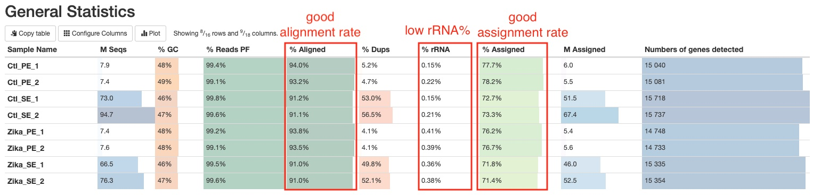
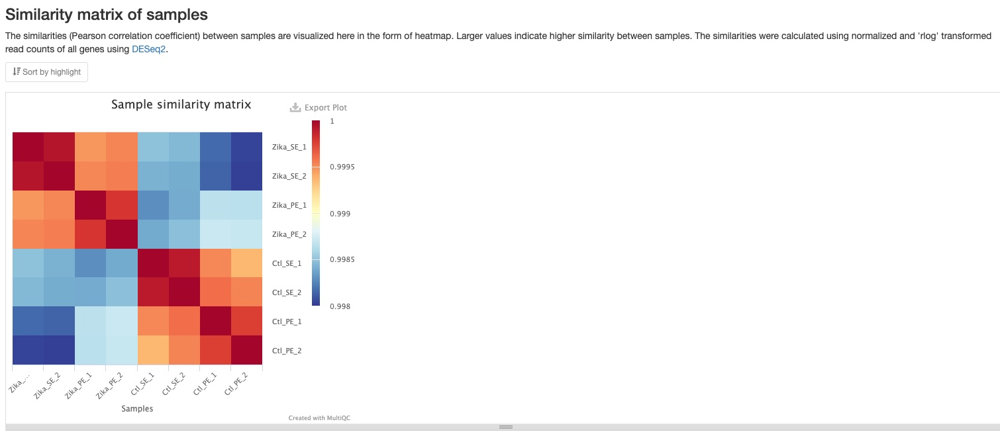
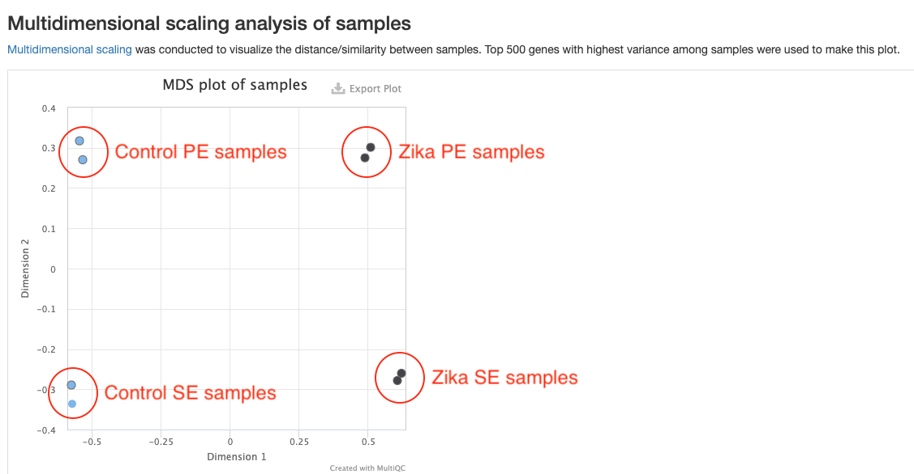
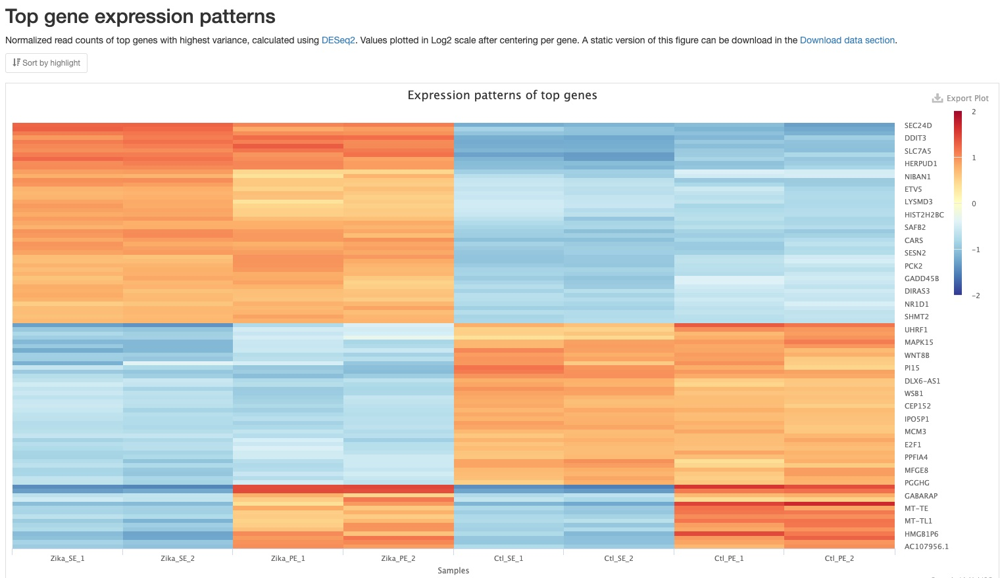
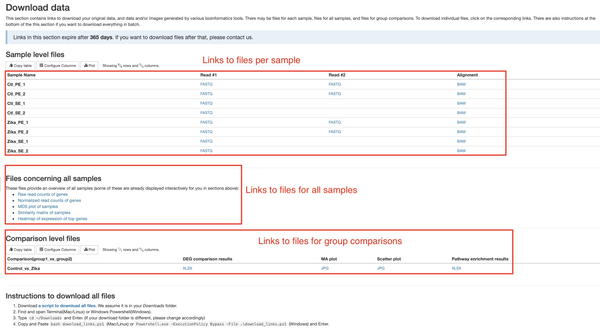

# How to interpret the RNAseq report

This document describes how to understand the RNAseq bioinformatics report delivered to you by Zymo. Most of the plots are taken from the [sample report](https://zymo-research.github.io/service-pipeline-documentation/reports/RNAseq_sample_report.html). The plots in your report might look a little different.

## Table of contents
* [Table of contents](#table-of-contents)
* [Bioinformatics pipeline overview](#bioinformatics-pipeline-overview)
* [Report overview](#report-overview)
* [General statistics table](#general-statistics-table)
* [Sample processing](#sample-processing)
  * [FastQC](#fastqc)
  * [Trim Galore](#trim-galore)
  * [STAR](#star)
  * [RSeQC](#rseqc)
  * [QualiMap](#qualimap)
  * [Picard](#picard)
  * [Preseq](#preseq)
  * [DupRadar](#dupradar)
  * [ERCC expression vs concentration](#ercc-expression-vs-concentration)
  * [Biotype Counts](#biotype-counts)
  * [featureCounts](#featureCounts)
* [Comparison of samples](#comparison-of-samples)
  * [Sample distance and similarity](#sample-distance-and-similarity)
    * [Sample Similarity](#sample-similarity)
    * [MDS plot](#mds-plot)
  * [Top gene expression patterns](#top-gene-expression-patterns)
  * [Differential gene expression](#differential-gene-expression)
  * [Gene set enrichment analysis](#gene-set-enrichment-analysis)
* [Download data](#download-data)
* [Pipeline information](#pipeline-information)
  * [Software versions](#software-versions)
  * [Workflow summary](#workflow-summary)

## Bioinformatics pipeline overview

The RNAseq bioinformatics pipeline is built using [Nextflow](https://www.nextflow.io/) and adapted from [nf-core/rnaseq pipeline](https://github.com/nf-core/rnaseq) version 1.4.2. A brief summary of pipeline:

1. Raw read QC ([`FastQC`](https://www.bioinformatics.babraham.ac.uk/projects/fastqc/))
2. Adapter trimming ([`Trim Galore!`](https://www.bioinformatics.babraham.ac.uk/projects/trim_galore/))
3. Alignment ([`STAR`](https://github.com/alexdobin/STAR))
4. Sample level QC:
    * various RNAseq related QC plots ([`RSeQC`](http://rseqc.sourceforge.net/))
    * 5' or 3' bias plot ([`Qualimap`](http://qualimap.bioinfo.cipf.es/))
    * Mark duplicates ([`Picard`](https://broadinstitute.github.io/picard/))
    * Library complexity estimation ([`Preseq`](http://smithlabresearch.org/software/preseq/))
    * Duplication rate QC ([`dupRadar`](https://bioconductor.org/packages/release/bioc/html/dupRadar.html))
    * Biotype composition plot ([`featureCounts`](http://bioinf.wehi.edu.au/featureCounts/))
    * ERCC spike-in plot ([[`STAR`](https://github.com/alexdobin/STAR) and [`featureCounts`](http://bioinf.wehi.edu.au/featureCounts/))
5. Read counting ([`featureCounts`](http://bioinf.wehi.edu.au/featureCounts/))
6. Sample comparison
    * Sample similarity matrix, sample MDS plot, heatmap of expression patterns of top genes ([`DESeq2`](https://bioconductor.org/packages/release/bioc/html/DESeq2.html)) 
    * Differential gene expression analysis ([`DESeq2`](https://bioconductor.org/packages/release/bioc/html/DESeq2.html))
    * Gene set enrichment analysis ([`g:Profiler`](https://biit.cs.ut.ee/gprofiler/gost))
7. Present all QC, analysis results in an interactive, comprehensive report ([`MultiQC`](http://multiqc.info/))

## Report overview
The bioinformatics report is generated using [`MultiQC`](https://multiqc.info/). There are general instructions on how to use a MultiQC report on [MultiQC website](https://multiqc.info/). The report itself also includes a link to a instructional video at the top of the report. In general, the report has a navigation bar to the left, which allows you to quickly navigate to one of many sections in the report. On the right side, there is a toolbox that allows to customize the appearance of your report and export figures and/or data. Most sections of the report are interactive. The plots will show you the sample name and values when you mouse over them.

## General statistics table
[The general statistics table](https://zymo-research.github.io/service-pipeline-documentation/reports/RNAseq_sample_report.html#general_stats) gives an overview of some important stats of your samples. For example, how many reads were in each run, what are the alignment rates, and how many reads were assigned to genes, etc. These stats are collected from different sections of the report to give you a snapshot. This is usually the quickest way for you to evaluate how your RNAseq experiment went. Here are a few important things you should look for when reading this table:
1. Most of your reads aligned uniquely to the genome (Column `% Aligned`). You should have different expectations for different organisms. For example, organisms with highly repetitive genomes would naturally have lower unique alignment rate. Nevertheless, at least 50% alignment rate should be expected for a successful RNAseq experiment. Low alignment rate often indicate contamination of foreign organisms in your samples.
2. rRNA contamination levels are low (Column `% rRNA`). The effectiveness of rRNA depletion vary from organism to organism and depend on your sample conditions. In general, a good RNAseq sample should have less than 10% rRNA. If your sample has more but not overwhelming amount of rRNA, for example 30%, don't panic, your data is still very much usable. There are still significant amount of non-rRNA reads that could allow a comprehensive and effective downstream analysis.
3. Most of your aligned reads are assigned to genes (Column `% Assigned`). This pipeline only assign reads to genes if they overlap with exons, so naturally there are reads that cannot be assigned to genes due to various reasons such as non-coding RNA, incomplete annotation of genes, etc. In general, a good RNAseq experiment with a good reference genome should have more than 50% of the aligned reads assigned to genes. If your sample has very few reads that can be assigned to genes, it often suggests DNA contamination. See [RSeQC section](#rseqc) for further information.

Other information you can get from this tables are (from left to right):
1. Numbers of reads. Make sure they are as expected.
2. GC content of reads. Make sure they are consistent with your organism of interest and there are no large differences between samples.
3. Percentages of reads pass filter after trimming. You should expect this number to be >90%.
4. Percentages of reads that are duplicates. Duplicate reads are common in RNAseq, especially in samples with high sequencing depth. High duplication rate doesn't necessarily signal problems. See [DupRadar section](#dupradar) for further information.
5. Numbers of reads assigned to genes. This number reflects a combination of factors such as sequencing depth, rRNA levels, DNA contamination, etc. So it is a good overall indicator of your experiment. A higher number of reads assigned to genes usually means better statitical power for downstream analysis.
6. Numbers of genes detected. You could mouse over the column to see a definition of "gene detected". With all other things equal, obviously, the more genes detected the better. However, genomic DNA contamination could inflate this number significantly because genomic DNA are more evenly distributed across the genome compared to RNA. Therefore, you shouldn't use this number as the sole indicator of your RNAseq experiment quality.

## Sample processing

### FastQC
[FastQC](http://www.bioinformatics.babraham.ac.uk/projects/fastqc/Help/) gives general quality metrics about your reads. It provides information about the quality score distribution across your reads (in [section `Sequnce Quality Histograms`](https://zymo-research.github.io/service-pipeline-documentation/reports/RNAseq_sample_report.html#fastqc_per_base_sequence_quality)), the per base sequence content (%A/C/G/T)(in [section `Per Base Sequence Content`](https://zymo-research.github.io/service-pipeline-documentation/reports/RNAseq_sample_report.html#fastqc_per_base_sequence_content)). You get information about adapter contamination (in [section `Adapter Content`](https://zymo-research.github.io/service-pipeline-documentation/reports/RNAseq_sample_report.html#fastqc_adapter_content)) and other overrepresented sequences (in [section `Overrepresented sequences`](https://zymo-research.github.io/service-pipeline-documentation/reports/RNAseq_sample_report.html#fastqc_overrepresented_sequences)). Some sections will sometimes issue warnings that your samples failed QC. It is important to remember that these QC metrics are from the raw reads, and there are often reasonable explanations why the raw RNAseq reads failed these QC. One frequent warning you might see is in the `Per Base Sequence Content` section (see below). The presence of adapter sequences at 5' or 3' end could trigger these warnings. These adapter sequences are trimmed off before alignment, so there is no need to worry about them in the raw reads. Random primers that are often used in RNAseq kits can trigger thse warning too, because these primers are not truly random. Another frequent warning you might see is in the [`Per Sequence GC Content` section](https://zymo-research.github.io/service-pipeline-documentation/reports/RNAseq_sample_report.html#fastqc_per_sequence_gc_content). This is because of the presence of significant amount of rRNA, which has a different GC content than rest of the genome. The presence of rRNA is not ideal, but does not prevent you from using the rest of the reads just fine, unless rRNA dominates the libraries.

### Trim Galore
[`Trim Galore!`](https://www.bioinformatics.babraham.ac.uk/projects/trim_galore/) apply quality and adapter trimming to FASTQ files. There are two sections in the report. The [`Filtered Reads` section](https://zymo-research.github.io/service-pipeline-documentation/reports/RNAseq_sample_report.html#trim_galore_filtered_reads) show numbers and percentages of reads that passed or failed filtering criteria for various reasons. Most of your reads should pass filters. If this is not the case, this section can tell you why. The `Trimmed Sequence Lengths` section show numbers of reads with certain lengths of adapters trimmed. It is normal to have a few base pairs of adapter sequences trimmed. A lot of reads with long stretch of adapter sequences trimmed off indicate problems with the library. Note, if you are using Zymo RiboFree Total RNA Library kit, you may notice a peak at 10bp in this plot. This is totally normal. This is because of the 10bp low complexity bridge used in our adapters.

### STAR
Trimmed reads are aligned to the genome using [`STAR`](https://github.com/alexdobin/STAR), which is designed specifically for RNAseq. The bar plot in the `STAR` section of the report shows the numbers/percentages of the reads that are aligned or not aligned. You can use the buttons on the top left to toggle between numbers and percentages. A good RNAseq sample should have majority of reads uniquely mapped. If you see a large percentage of reads mapped to multiple loci, this might indicate rRNA contamination, check `Biotype Counts` section to confirm this. Large numbers of reads that not aligned indicate possible contamination of foreign organims.

### RSeQC
RSeQC is a package of scripts designed to evaluate the quality of RNA seq data. You can find out more about the package at the [RSeQC website](http://rseqc.sourceforge.net/). This pipeline runs several, but not all RSeQC scripts. All of these results are summarised within the report and described below.

1. **Read Distribution** 
This section shows how mapped reads are distributed over genome features, including introns, exons, etc. A good RNAseq sample should have majority of reads aligned to exons.

2. **Inner Distance** 
This section shows the inner distance (or insert size) between two paired RNA reads. Note that this can be negative if fragments overlap. See if the distribution matches with the expected fragment sizes in your library preparation. This section is only applicable to paired-end reads. 

3. **Read Duplication** 
This plot shows the number of reads (y-axis) with a given number of exact duplicates (x-axis). Most reads in an RNA-seq library should have a low number of exact duplicates, indicated by sharp decline on the left side of the curve. Otherwise, it might indicate technical duplications in your libraries. Please note that the numbers are not normalized by sequencing depth, so samples with much higher sequencing depths are expected to have more area under the curve (see below).

4. **Junction Annotation** 
This plot compares the splice junction detected against the known ones in the reference gene model. For a model organism, you should expect most of the junctions are known. 

5. **Junction Saturation** 
This plot shows the number of splice sites detected at the data at various levels of subsampling. A sample that reaches a plateau before getting to 100% data indicates that all junctions in the library have been detected, and that further sequencing will not yield more observations.

6. **Infer experiment** 
This plot shows the strandedness of your libraries. You should compare this with the chemistry of your library kit. For example, if the kit has reverse-stranded chemistry, you should expect most of the reads are "antisense". If they don't match, it could indicate a problem with your libraries. If you see equal amounts of "sense" and "antisense" reads in a stranded or reverse-stranded library prep, it could indicate large amounts of DNA contamination, because reads resulting from DNA are not stranded.

7. **Bam Stat** 
This plot summarizes various other stats about aligned reads. It is useful when you are looking for a specific stat. You can mouse over dots to show the exact number.

### QualiMap
We use [`Qualimap`](http://qualimap.bioinfo.cipf.es/) to check the distribution of read overage (Y-axis) over the length of a gene (X-axis), to check for biases near 5' or 3' ends of the gene. The type of library prep kit you used and the quality of your RNA may have an impact on the shape of the curve. If the library was produced using a "total RNA" strategy, you should expect to see a trapezoid shaped curve, that is flat across the gene body, but dips at both ends (see below). On the other hand, if the library was produced using a "polyA tail selection" strategy, you might see the curve slightly higher near the 3' end compared to other parts of the gene. RNA degredation can also result in higher coverage near the 3' end (see [this paper](https://journals.plos.org/plosone/article?id=10.1371/journal.pone.0091851)).

### Picard
We use [`Picard MarkDuplicates`](https://broadinstitute.github.io/picard/command-line-overview.html#MarkDuplicates) to mark duplicate reads. This section plots the number/percentage of duplicate reads. Read duplication is very common in RNAseq, and is affected by many factors. Single-end data tend to have higher duplication rate than paired-end data. Higher sequencing depth usually lead to higher duplication rate. High duplication rate does not necessarilly indicate problems with the library. The duplication reads in each sample will be further analyzed in section `DupRadar`. 

### Preseq
[Preseq](http://smithlabresearch.org/software/preseq/) estimates the complexity of a library, showing how many additional unique reads are sequenced for increasing the total read count. A shallow curve indicates that the library has reached complexity saturation and further sequencing would likely not add further unique reads. The dashed line shows a perfectly complex library where total reads = unique reads.

Note that these are predictive numbers only, not absolute. This plot can sometimes give extreme sequencing depth on the X axis - click and drag from the left side of the plot to zoom in on more realistic numbers.

In the sample report, we can see the curve is still near linear at the sequencing depths currently used. This indicates sequencing more can disover more unique RNA molecules, and you will start to get diminishing returns at 150-200 million reads. 

### Dupradar
[dupRadar](https://bioconductor.org/packages/release/bioc/html/dupRadar.html) plots the cumulative duplication rate (Y-axis) against gene expression level (X-axis). Highly expressed genes have mnay copies of mRNA molucules, thus are expected to have many duplicate reads in the library, while lowly expressed genes should not. Therefore, a good RNAseq sample should have a curve that rises slowly at lower expression levels, and quickly at higher expression levels. In comparison, a bad sample with lots of technical replication have high duplication rate at lower expression levels, and the slope of the curve is similar across expression levels (See example figure from [dupRadar Documentation](https://www.bioconductor.org/packages/devel/bioc/vignettes/dupRadar/inst/doc/dupRadar.html) below).

As mentioned above, other factors such as sequencing depth and whether the data is single or paired-end affects the duplication rate. Therefore, when comparing samples, it is important to keep this in mind. In the sample report, even though the single-end, deep sequenincg datasets have higher duplication rate, the shape of the curve is similar to those of good RNAseq samples, and the duplication rates are low for lowly expressed genes. This indicates those samples are of good quality.

### ERCC expression vs concentration
If ERCC spike-in mixes were added to RNAseq samples, the report will plot the relative expression levels (Y-axis) against known concentrations of ERCC transcripts. For good RNAseq samples, you should expect to see a linear relationship between the two, at least for transcripts with higher concentrations. For transcripts with lower concentrations, a near flat line should be expected, as those transcripts are below detection limit with lower sequencing depths. Therefore, this plot also helps you identify the detection limit of your RNAseq experiment.

### Biotype Counts
This plot summarizes the composition of reads from different biotypes. A good RNAseq sample should have a large portion of the reads coming from protein coding genes. This plot can help you spot problems with your library such as incomplete rRNA depletion. Please note that this plot is generated from reads overlapping exons, reads that are labeled "Unassigned_NoFeatures" are likely reads overlapping other parts of a genes such as introns. If the percentage of such reads are very high in a sample, it might indicate problems with the sample, such as DNA contamination.

### featureCounts
[`featureCounts`](http://bioinf.wehi.edu.au/featureCounts/) assigns reads that overlap exons to corresponding genes. This plot in the report summarizes how many reads are assigned and reasons why they are not assigned. A good RNAseq sample should have majority of reads assigned to genes. If a large portion of reads are "Unassigned_MultiMapping", this implies rRNA contamination in the sample, please confirm this with `Biotype Counts` plot. If a large portion of reads are "Unassigned_NoFeatures", this implies DNA contamination, you can see if `RSeQC` `Infer experiment` plot corroborates this suspicion.

## Comparison of samples

### Sample distance and similarity
The pipeline uses [`DESeq2`](https://bioconductor.org/packages/release/bioc/html/DESeq2.html) to generate two overview plots of all samples, when there are more than 2 samples in the study. They are generated using normalized read counts of genes. When there are replicates in your study, the normalized counts are further transformed using the `rlog` algorithm in `DESeq2` to reduce noise.

#### Sample similarity
This plot shows the Pearson correlation coefficient between pairs of samples. You can mouse over the colored blocks to see correlation coefficients. This plot is made using all genes and because most of genes are expected to not significantly regulated between conditions/treatments, these coefficients are usually very close to 1. However, you can still clearly notice the difference between groups of samples.

#### MDS plot
This plots shows the distances between all samples. Each dot represents a sample and distances between dots represent differences in gene expression patterns between samples. Only the top 500 genes with highest variances are used to make this plot. You should expect replicate samples to be close to each other. You would hope to see clear distances between your comparison groups. This plot can help reveal some problems with your experiment such as batch effects. For example, in the sample report, there are clear differences between the Zika and Control groups, but there are also strong batch effects between the two sequencing runs. This batch effect should be corrected in downstream analysis. This is not currently done in our pipeline, but will be added in the future.

### Top gene expression patterns
This plot shows a heatmap of expression patterns of top 100 genes with highest variance. Log2 values of fold changes of genes against their mean expression levels among all samples are plotted. Positive numbers (red) indicate higher expression levels, while negative numbers(blue) indicate lower expression levels. The genes were also clustered using hierarchical clustering. This plot gives you an overview of expression patterns among genes with most significant changes in their expression. You can also mouse over to see values for specifc gene and sample. In the sample report, you can clearly see three patterns among the top 100 genes: (1) higher in Zika samples, (2) higher in Control samples, and (3) higher in PE samples. A static version of this plot can also be downloaded in the `Download data` section.

### Differential gene expression
The pipeline uses [`DESeq2`](https://bioconductor.org/packages/release/bioc/html/DESeq2.html) to conduct differential gene expression analysis if you experiment was conducted with replication.

1. **Summary table** 
The number of genes that are significantly differentially expressed between groups/conditions are summarized in a table. The numbers are dependent on the false discovery rate (FDR) and fold change cutoffs. You can find those values in the `Workflow summary` section of the report.

2. **Scatter plot** 
This plot shows a simple comparison of gene expression levels between two groups/conditions. Red dots represent differentially expressed genes, while grey ones represent genes not differentially expressed. One useful feature of this plot is that you can see the name of the gene when you mouse over a dot. Please note that not all genes are plotted here for technical reasons, but most if not all differentiall expressed genes should be plotted. You can download a static version with all genes plotted in the `Download data` section.

3. **MA plot** 
This plot presents the same data as the scatter plot, but in a different way. It plots Log2 fold changes (Y-axis) against mean expression levels (X-axis). This type of plot is common in RNAseq publications. Function and limitation of this plot are the same as the scatter plot.

4. **Top 50 differentially expressed genes** 
For each comparison, we list the top 50 differentially expressed genes (ranked by FDR) for your quick examination. You can download the full results of differential expression analysis in the `Download data` section. For each gene, the gene name, mean counts, Log2 fold change, and FDR are listed. If your reference genome is on [Ensembl Genomes](http://ensemblgenomes.org/), you can click on the gene names to view more information about that gene on Ensembl. 

### Gene set enrichment analysis
The pipeline conducts gene set enrichment analysis among differentially expressed genes using [`g:Profiler`](https://biit.cs.ut.ee/gprofiler/gost). This analysis can tell you genes from which pathways or functional groups are enriched in the differentially expressed genes. Gene sets from [Gene Ontology](http://geneontology.org/) "biological process" subset, [Reactome](https://reactome.org/), and [KEGG](https://www.genome.jp/kegg/) are used in this analysis.

1. **Summary table** 
The number of gene sets that are significantly enriched are summarized in a table. The numbers are dependent on the false discovery rate (FDR) cutoff, which is listed in the text atop the table.

2. **Top 30 enriched gene sets** 
For each comparison, we list the top 30 enriched gene sets (ranked by FDR) for your quick examination. You can download the full results of gene set enrichment analysis in the `Download data` section. You can click on the name of each gene set to view more information about that gene set.

## Download data
This section of the report can deliver all your original data, intermediate analysis files, and final results to you via the internet. To protect your data, we have made the links in this section to automatically expire in 60 days. If you want to download your files after that, please do not hesitate to contact us. There are three subsections: (1) files for each sample, (2) files concerning all samples, and (3) files for each pairwise comparison. Different file types are arranged in tables or list. Simply click on the links to download individual files. We also provide you a way to download everything altogether. Please follow the instructions in the last subsection. If your institution has limits on how you download files from the internet, please do not hesitate to contact us. We will find a suitable way for you to download your data.

## Software versions
This section lists the versions of softwares used in this bioinformatic pipeline. This should help you in writing the methods section of your publication or if you wish to carry out some of the analysis on your own.

## Workflow summary
This section lists some important parameters of this particular study. This often includes which reference genome is used, how the trimming was done, and false discovery rate (FDR) and fold change thresholds used in differential gene expression analysis and gene set enrichment analysis. 
