# How to interpret the small RNAseq report

This document describes how to understand the small RNAseq bioinformatics report delivered to you by Zymo. Most of the plots are taken from the [sample report](https://zymo-research.github.io/service-pipeline-documentation/reports/smallRNAseq_sample_report.html). The plots in your report might look a little different.

## Table of contents
* [Table of contents](#table-of-contents)
* [Bioinformatics pipeline overview](#bioinformatics-pipeline-overview)
* [Report overview](#report-overview)
* [General statistics table](#general-statistics-table)
* [Sample processing](#sample-processing)
  * [FastQC](#fastqc)
  * [Trim Galore](#trim-galore)
  * [miRTrace](#mirtrace)
    * [Read length distribution](#read-length-distribution)
    * [Contamination Check](#contamination-check)
    * [miRNA complexity](#mirna-complexity)
* [Pipeline](#pipeline)
  * [Estimated RNA Type Counts](#estimated-rna-type-counts) 
* [Comparison of samples](#comparison-of-samples)
  * [Sample distance and similarity](#sample-distance-and-similarity)
    * [Sample similarity](#sample-similarity)
    * [MDS plot](#mds-plot)
  * [Top gene expression patterns](#top-gene-expression-patterns)
  * [Differential gene expression](#differential-gene-expression)
* [Download data](#download-data)
* [Pipeline information](#pipeline-information)
  * [Software versions](#software-versions)
  * [Workflow summary](#workflow-summary)

## Bioinformatics pipeline overview

The small RNAseq bioinformatics pipeline is built using [Nextflow](https://www.nextflow.io/) and adapted from [nf-core/smrnaseq pipeline](https://github.com/nf-core/smrnaseq) version 1.0.0. A brief summary of pipeline:

1. Raw read QC ([`FastQC`](https://www.bioinformatics.babraham.ac.uk/projects/fastqc/))
2. Adapter trimming ([`Trim Galore!`](https://www.bioinformatics.babraham.ac.uk/projects/trim_galore/))
3. miRNA quality control using reads from step 2 ([`mirtrace`](https://github.com/friedlanderlab/mirtrace))
4. miRNA alignment, quantification, and differential expression analysis:
   1. Collapse duplicate reads ([`seqcsluter`](https://seqcluster.readthedocs.io/mirna_annotation.html#processing-of-reads))
   2. Alignment against miRBase hairpin with reads from step 4i ([`Bowtie1`](http://bowtie-bio.sourceforge.net/index.shtml))
   3. miRNA and isomiR annotation of above alignments ([`mirtop`](https://github.com/miRTop/mirtop))
   4. Sample comparison and statistical analysis ([`isomiRs`](https://www.bioconductor.org/packages/release/bioc/html/isomiRs.html))
5. Small RNA types alignment, quantification, and differential expression analysis:
   1. Alignment with reads from step 2 against mature tRNA (GtRNAdb), mitochondrial tRNA, lncRNA, scaRNA, snoRNA, snRNA, miscRNA (Ensembl), rRNA (Ensembl and UCSC Repeatmasker), and miRNA hairpin (miRBase) ([`Bowtie1`](http://bowtie-bio.sourceforge.net/index.shtml)) 
   2. Read count quantification using RSEM with above alignments ([`RSEM`](http://deweylab.github.io/RSEM/README.html))
   3. RSEM results summary with tximport ([`tximport`](https://bioconductor.org/packages/release/bioc/vignettes/tximport/inst/doc/tximport.html))
   4. Differential expression analysis of non-miRNA RNA types using step 5iii tximport summary ([`DESeq2`](https://bioconductor.org/packages/release/bioc/html/DESeq2.html))
6. Present stats, plots, results ([`MultiQC`](http://multiqc.info/))

## Report overview
The bioinformatics report is generated using [`MultiQC`](https://multiqc.info/). There are general instructions on how to use a MultiQC report on [MultiQC website](https://multiqc.info/). The report itself also includes a link to a instructional video at the top of the report. In general, the report has a navigation bar to the left, which allows you to quickly navigate to one of many sections in the report. On the right side, there is a toolbox that allows to customize the appearance of your report and export figures and/or data. Most sections of the report are interactive. The plots will show you the sample name and values when you mouse over them.

## General statistics table
[The general statistics table](https://zymo-research.github.io/service-pipeline-documentation/reports/smallRNAseq_sample_report.html#general_stats) gives an overview of some important stats of your samples. For example, how many reads were in each sample, how many reads passed filter, and how many reads were miRNA reads, etc. These stats are collected from different sections of the report to give you a snapshot. This is usually the quickest way for you to evaluate how your small RNAseq experiment went. Here are a few important things you should look for when reading this table:
1. Most of your reads passed filtering requirements after trimming. We have set the read filtering requirements according expected size of small RNAs (by default: reads longer than 18 bp, you can find the exact requirements in the [`Workflow Summary` section](https://zymo-research.github.io/service-pipeline-documentation/reports/miRNAseq_sample_report.html#workflow_summary)). While it is rare that this number approach 100%, but one would hope most samples have more than 50% reads that are small RNAs.
2. How much of your reads pass filtering are from miRNAs. There are many types of small RNAs other than miRNAs, so it is natural that only a portion of your reads come from miRNAs. We normally expect to see more miRNA reads than other types. We have seen a wide range of miRNA% in different samples, but in general, miRNA% <10% indicates problems with your sample. You can find more information on the composition of your reads in the [`miRTrace RNA Categories` section](https://zymo-research.github.io/service-pipeline-documentation/reports/smallRNAseq_sample_report.html#mirtrace_rna_categories). 

      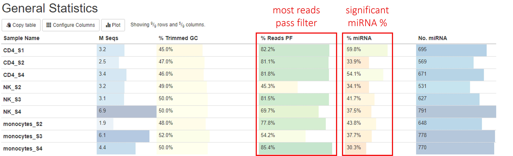

Other information you can get from this tables are (from left to right):
1. Numbers of reads. Make sure they are as expected.
2. % GC content of reads after adapter and quality trimming. Make sure they are consistent with your organism of interest and there are no large differences between samples.
3. Numbers of miRNA genes detected. Many different factors such as sequencing depth, library quality, completeness of miRNA reference database can have impact on this number, so it is difficult to say how many miRNA genes you are expected to find. However, generally, there should be at least 100 different miRNA genes detected, and you should not expect great differences between your samples in the same study.

## Sample processing

### FastQC
[FastQC](http://www.bioinformatics.babraham.ac.uk/projects/fastqc/Help/) gives general quality metrics about your reads. It provides information about the quality of your reads (in [section `Sequnce Quality Histograms`](https://zymo-research.github.io/service-pipeline-documentation/reports/miRNAseq_sample_report.html#fastqc_per_base_sequence_quality), [section `Per Sequence Quality Scores`](https://zymo-research.github.io/service-pipeline-documentation/reports/miRNAseq_sample_report.html#fastqc_per_sequence_quality_scores), and [section `Per Base N Content`](https://zymo-research.github.io/service-pipeline-documentation/reports/miRNAseq_sample_report.html#fastqc_per_base_n_content)). Section `Adapter Content` shows you how many reads have adapters in them. As you can see the sample report, in miRNAseq libraries, most if not all reads have adapters at the 3' end because of the short inserts. This would usually produce warnings in `FastQC`, however we have disabled that here because this is perfectly normal in miRNAseq.

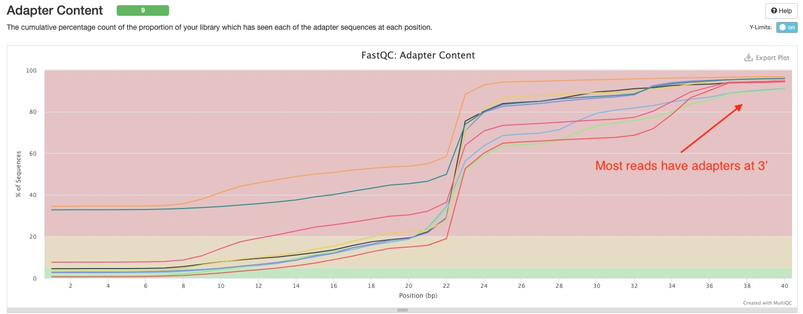

### Trim Galore
[`Trim Galore!`](https://www.bioinformatics.babraham.ac.uk/projects/trim_galore/) apply quality and adapter trimming to FASTQ files. There are two sections in the report. The [`Filtered Reads` section](https://zymo-research.github.io/service-pipeline-documentation/reports/miRNAseq_sample_report.html#trim_galore_filtered_reads) show numbers and percentages of reads that passed or failed filtering criteria for various reasons. Most of your reads should pass filters. If this is not the case, this section can tell you why. You can find the definition of reads being "too short" or "too long" in the `Workflow Summary` section of the report. 
The `Trimmed Sequence Lengths` section show numbers of reads with certain lengths of adapters trimmed. Most of your reads would have bps trimmed off. In the sample report, you can see there is a peak at 29 bp which suggest majority of the small RNA inserts are `51 - 29 = 22` bp long. There are also peaks at 51 bp for some samples. Those are likely reads derived from primer-dimers and other library artifcats.

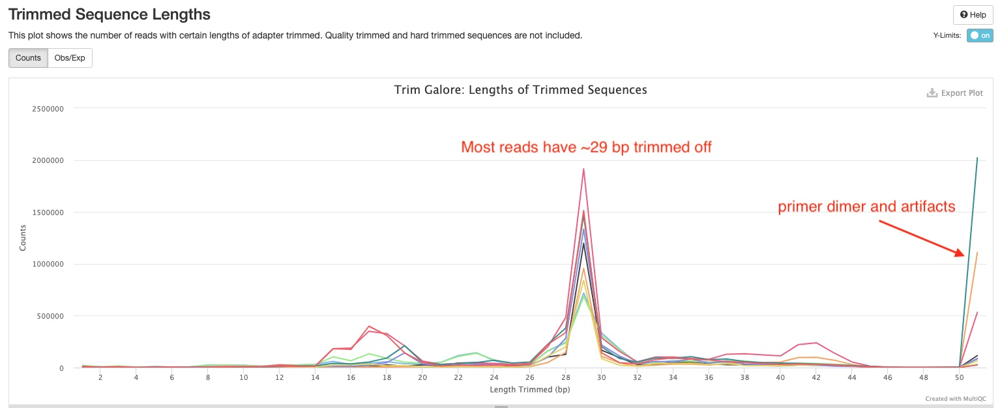

### miRTrace
[`miRTrace`](https://github.com/friedlanderlab/mirtrace) generates several useful quality control plots for miRNAseq data.

#### Read Length Distribution
This section shows your the distribution of read lengths post-trimming and filtering. In the sample report, you can see majority of the reads are around 22 bp long, which is consistent with the expected length of miRNAs.

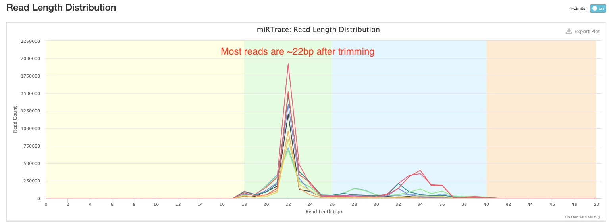

#### Contamination Check
This section shows you whether any of your samples might have contaminations from a foreign organism. Please know that this only works if the contaminating organism is distantly related to the organism of interest, for example, insect RNA in a human sample. It won't detect contaminations from closely related organisms, for example, mouse RNA in human sample. In the sample report, all samples are clean.

#### miRNA complexity
This section plots how many miRNA hairpins are detected at different sequencing depths. This would help you understand whether you have sequenced enough for your samples, and whether/how much more sequencing would help discover more miRNA hairpins. In the sample report, you can see all curves are either starting to or have already flatten. Therefore, there will be diminishing returns for more sequencing in most if not all of them.

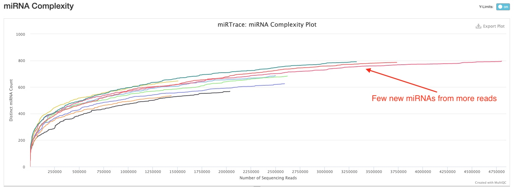

### Pipeline

#### Estimated RNA Type Counts

RSEM quantifies the number of reads derived from miRNA, tRNA, rRNA, lncRNA, miscRNA, scaRNA, snoRNA, and snRNA. The "Unknown" category most likely encompasses other small RNAs such as piRNA, siRNA, etc. You can use the button on the top left to toggle between numbers and percentages of reads. 

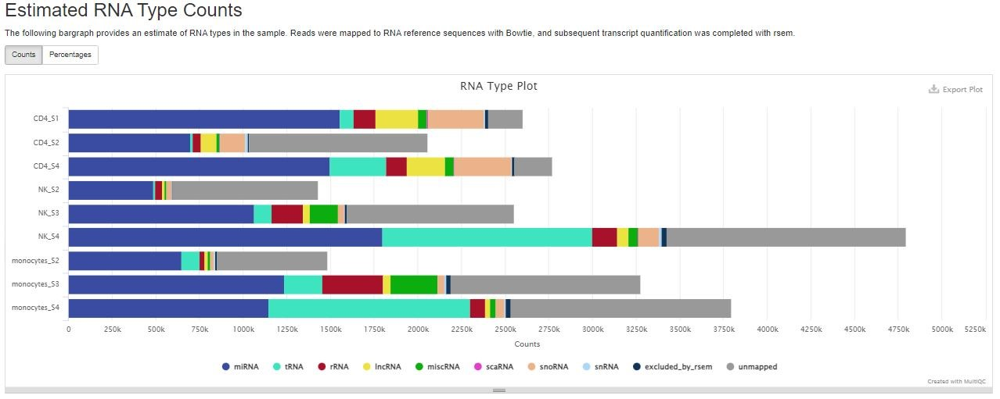

## Comparison of samples

### Sample distance and similarity
When there are more than 2 samples in the study, the pipeline will generate two sets of overview plots for all samples. The first set is generated using normalized read counts of all mature miRNAs with [`isomiRs`](https://www.bioconductor.org/packages/release/bioc/html/isomiRs.html), which uses [`DESeq2`](https://bioconductor.org/packages/release/bioc/html/DESeq2.html) under the hood. The second set is generated with [`DESeq2`](https://bioconductor.org/packages/release/bioc/html/DESeq2.html) using normalized read counts of several RNA Types (tRNA, lncRNA, miscRNA, scaRNA, snoRNA, snRNA), excluding miRNA and rRNA.

#### Sample similarity
This plot shows the Pearson correlation coefficient between pairs of samples. You can mouse over the colored blocks to see correlation coefficients. This pipeline will generate two sample similarities plots, one of which will be made using all mature miRNAs, and the other using read counts of 6 RNA types (tRNA, lncRNA, miscRNA, scaRNA, snoRNA, snRNA). In the miRNA plot below, you can clearly notice the difference between groups of samples (different cell types).

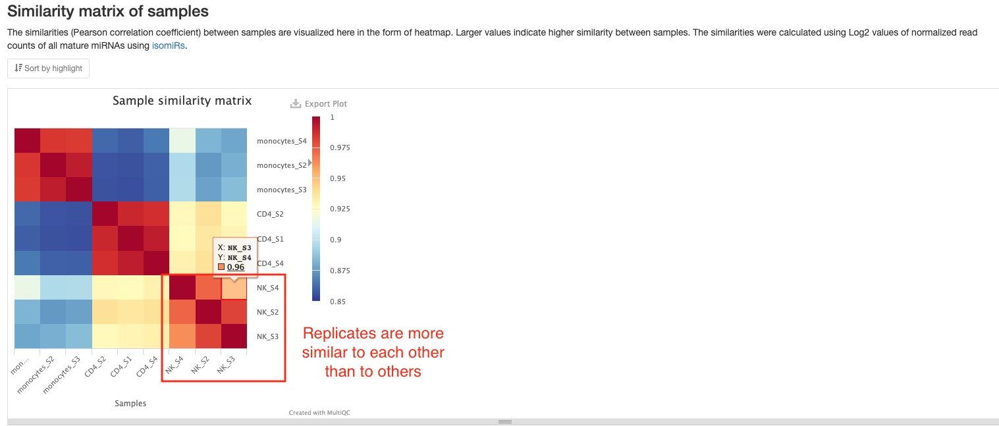

#### MDS plot
This plot shows the distances between all samples. Each dot represents a sample and distances between dots represent differences in RNA gene expression patterns between samples. This pipeline will generate two MDS plots, one of which will be made using mature miRNAs, and the other using read counts of 6 RNA types (tRNA, lncRNA, miscRNA, scaRNA, snoRNA, snRNA). Only the top 500 RNAs with highest variances are used to make both plots. You should expect replicate samples to be close to each other, and hope to see clear distances between your comparison groups, as is the case in the sample report.

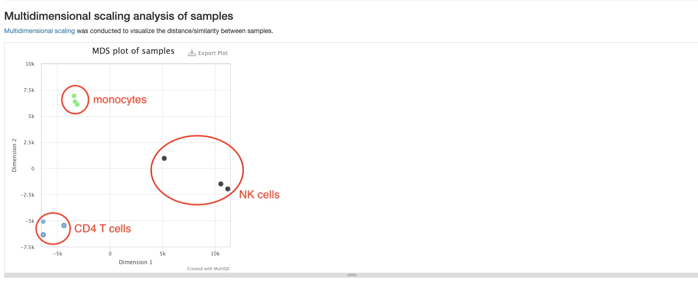

### Top gene expression patterns
This pipeline will generate two plots to represent top gene expression patterns. One will be made using only mature miRNA and the other will show results from the small RNA types tRNA, lncRNA, miscRNA, scaRNA, snoRNA, and snRNA. This plot shows a heatmap of expression patterns of the top 100 RNAs with highest variance from each of the two categories previously mentioned. Both graphs plot log2 fold change values of the two RNA categories against their mean expression levels among all samples. In both graphs, positive numbers (red) indicate higher expression levels, while negative numbers (blue) indicate lower expression levels. The RNA results are clustered using hierarchical clustering. This plot gives you an overview of expression patterns among RNAs with most significant changes in their expression. You can also mouse over to see values for specifc RNA and sample. In the sample report featuring an miRNA heatmap below, you can clearly see different miRNAs being most highly expressed in different cell types. A static version of this plot can also be downloaded in the `Download data` section.

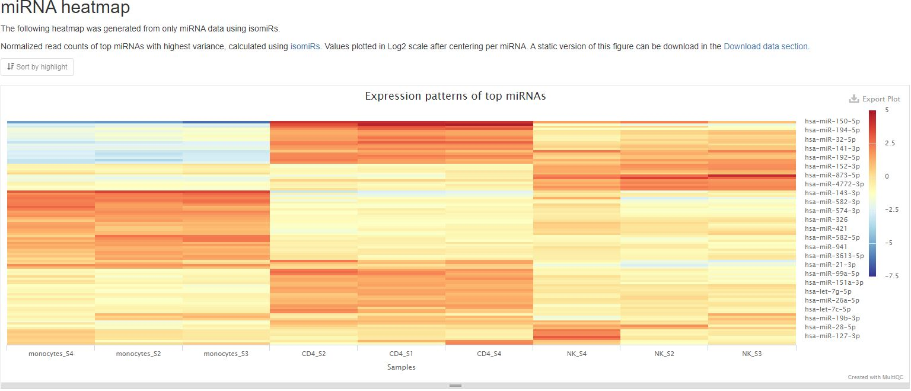

### Differential gene expression
If your experiment was conducted with replication, this pipeline runs differential gene expression analysis twice, once for miRNA with [`isomiRs`](https://www.bioconductor.org/packages/release/bioc/html/isomiRs.html), which uses [`DESeq2`](https://bioconductor.org/packages/release/bioc/html/DESeq2.html) under the hood, and again for 6 small RNA type genes (tRNA, lncRNA, miscRNA, scaRNA, snoRNA, snRNA) with only [`DESeq2`](https://bioconductor.org/packages/release/bioc/html/DESeq2.html).

1. **Summary table** 
This pipeline will generate two tables summarizing the number of mature miRNAs and the number of RNA genes(tRNA, lncRNA, miscRNA, scaRNA, snoRNA, snRNA) that are significantly differentially expressed between groups/conditions. The numbers are dependent on the false discovery rate (FDR) and fold change cutoffs. You can find those values in the `Workflow summary` section of the report.

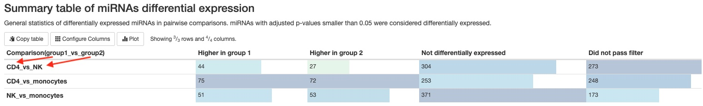

2. **Scatter plot** 
This pipeline will generate two of these plots, which show a simple comparison of mature miRNA expression levels or genes from the 6 RNA types between two groups/conditions. Red dots represent differentially expressed genes, while grey ones represent genes not differentially expressed. One useful feature of this plot is that you can see the name of the RNA gene when you mouse over a dot. You can toggle between the different comparisons using the buttons at the top left corner. You can download a static version with all genes plotted in the `Download data` section.

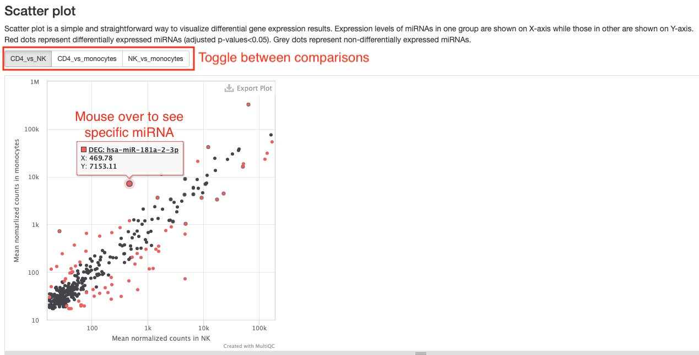

3. **MA plot** 
This plot presents the same data as the scatter plot, but in a different way. It plots Log2 fold changes (Y-axis) against mean expression levels (X-axis). This type of plot is common in RNAseq publications.

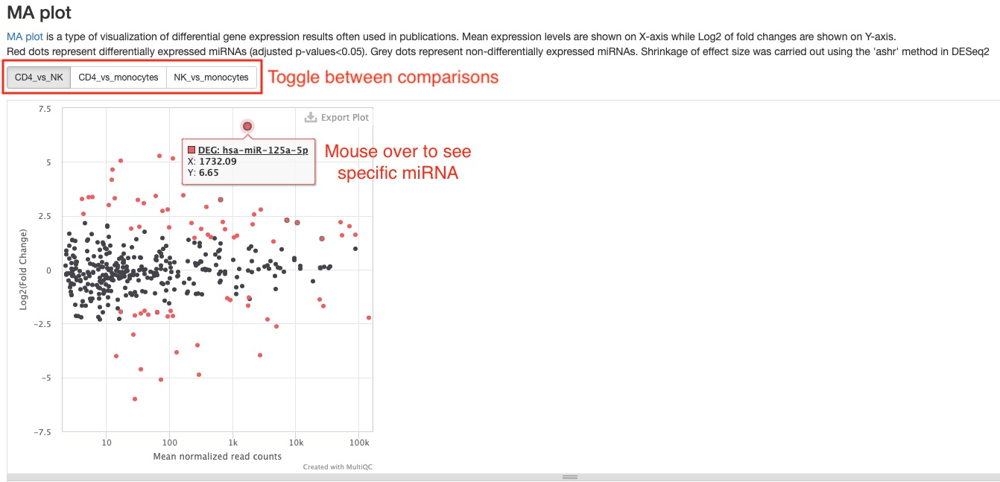

4. **Top 50 differentially expressed genes** 
For each comparison, we list the top 50 differentially expressed RNAs (ranked by FDR) for your quick examination. You can download the full results of differential expression analysis in the `Download data` section. For each RNA gene, the name, mean counts, Log2 fold change, and FDR are listed. You can click on miRNA names or RNAs with Ensembl gene IDs (in humans, these start with "ENSG") to view more information about that gene from their respective databases. 

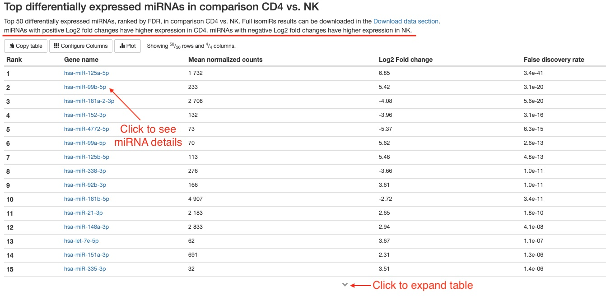

## Download data
This section of the report can deliver all your original data, intermediate analysis files, and final results to you via the internet. To protect your data, we have made the links in this section to automatically expire in 60 days. If you want to download your files after that, please do not hesitate to contact us. There are three subsections: (1) files for each sample, (2) files concerning all samples, and (3) files for each pairwise comparison. Different file types are arranged in tables or list. Simply click on the links to download individual files. We also provide you a way to download everything altogether. Please follow the instructions in the last subsection. If your institution has limits on how you download files from the internet, please do not hesitate to contact us. We will find a suitable way for you to download your data.

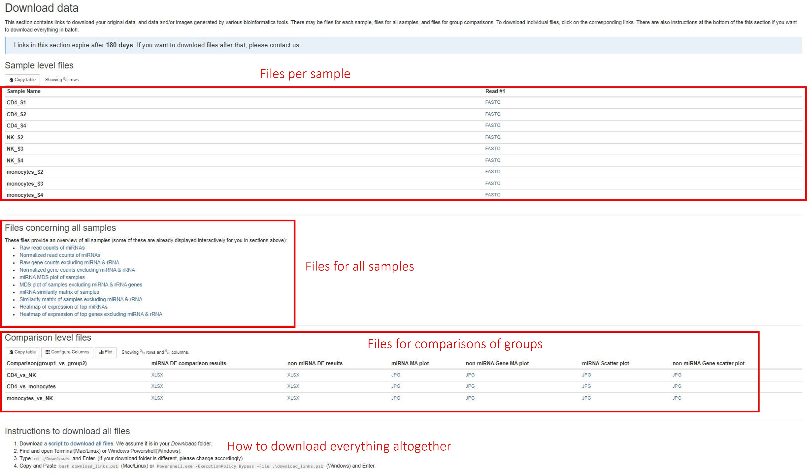

## Software versions
This section lists the versions of softwares used in this bioinformatic pipeline. This should help you in writing the methods section of your publication or if you wish to carry out some of the analysis on your own.

## Workflow summary
This section lists some important parameters of this particular study. This often includes which reference genome is used, how the trimming was done, and false discovery rate (FDR) and fold change thresholds used in differential gene expression analysis. 
